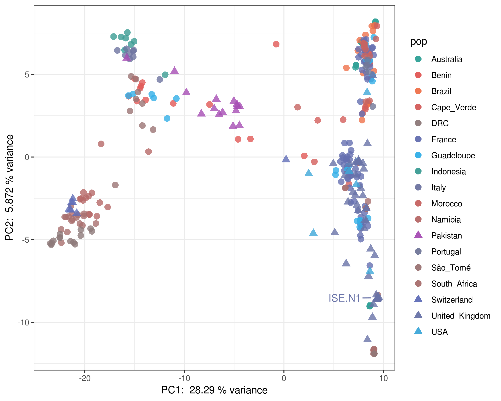

# Haemonchus genome - genome variation analyses

## Table of contents

1. [mtDNA analysis](#mtdna_analysis)
2. [World map of sampling sites](#global_sampling_map)
3. [Genome wide nucleotide diversity analysis](#nuc_div)


# PCA of mtDNA genotypes


#--- filter
```shell


bcftools-1.9 view -e 'FORMAT/DP[0]<10 | MQ[*]<30' 7.hcontortus_chr_mtDNA_arrow_pilon.cohort.vcf.gz | bcftools-1.9 view -i 'TYPE="snp" & AF>0.01' -O z -o allsamples.mtDNA.filtered.vcf.gz

awk -F '[_]' '{print $0,$1,$2}' OFS="\t" samples.list > samples.pops.list
```
```R
R-3.5.0
library(gdsfmt)
library(SNPRelate)
library(ggplot2)

vcf.in <- "allsamples.mtDNA.filtered.vcf.gz"
gds<-snpgdsVCF2GDS(vcf.in, "mtDNA.gds", method="biallelic.only")

genofile <- snpgdsOpen(gds)

pca	<-	snpgdsPCA(genofile, num.thread=2,autosome.only = F)

pops<-	read.table("samples.pops.list",header=F)

tab <- data.frame(sample.id = pca$sample.id,
                  EV1 = pca$eigenvect[,1],    # the first eigenvector
                  EV2 = pca$eigenvect[,2],
                  EV3 = pca$eigenvect[,3],
                  EV4 = pca$eigenvect[,4],
                  EV5 = pca$eigenvect[,5],
                  EV6 = pca$eigenvect[,6],    # the second eigenvector
                  COUNTRY = pops$V2,
                  POP = pops$V3,
                  stringsAsFactors = FALSE)

plot(tab$EV2, tab$EV1, xlab="eigenvector 2", ylab="eigenvector 1",pch=20,cex=2,col=pops$V2)
```


```R
R-3.5.0
library(vcfR)
library(poppr)
library(ape)
library(RColorBrewer)
library(dplyr)
library(ggplot2)
library(ggrepel)
library(patchwork)

metadata<-read.table("sample_metadata_colours.list",header=T,comment.char="",sep="\t")

rubi.VCF <- read.vcfR("allsamples.mtDNA.filtered.vcf.gz")
pop.data <- read.table("samples.pops.list", sep = "\t", header = F)
gl.rubi <- vcfR2genlight(rubi.VCF)
ploidy(gl.rubi) <- 1

pop(gl.rubi) <- metadata$country


# distance matrix from genlight object
#x.dist <- poppr::bitwise.dist(gl.rubi)


# make a tree
#tree <- aboot(gl.rubi, tree = "upgma", distance = bitwise.dist, sample = 100, showtree = F, cutoff = 50, quiet = T)
#write.tree(tree, file="MyNewickTreefile.nwk")


#cols <- brewer.pal(n = nPop(gl.rubi), name = "Dark2")
#plot.phylo(tree, cex = 0.3, font = 2, adj = 0)
#nodelabels(tree$node.label, adj = c(1.3, -0.5), frame = "n", cex = 0.3,font = 3, xpd = TRUE)
#legend(35,10,c("CA","OR","WA"),cols, border = FALSE, bty = "n")
#legend('topleft', legend = c("CA","OR","WA"),fill = cols, border = FALSE, bty = "n", cex = 2)
#axis(side = 1)
#title(xlab = "Genetic distance (proportion of loci that are different)")


# pca


rubi.pca <- glPca(gl.rubi, nf = 10)
var_frac <- rubi.pca$eig/sum(rubi.pca$eig)*100
rubi.pca.scores <- as.data.frame(rubi.pca$scores)
rubi.pca.scores$pop <- pop(gl.rubi)
rubi.pca.scores$strain <- metadata$strain
set.seed(9)


#--- plot eigenvectors
barplot(100*rubi.pca$eig/sum(rubi.pca$eig), col = heat.colors(50), main="PCA Eigenvalues")
title(ylab="Percent of variance\nexplained", line = 2)
title(xlab="Eigenvalues", line = 1)


#--- plot PCA


#p12 <- ggplot(rubi.pca.scores, aes(x=PC1, y=PC2, colour=pop, label=pop)) + geom_point(size=2)+ theme_bw() + geom_text_repel(data = subset(rubi.pca.scores, pop == "ZAI" ))
#p34 <- ggplot(rubi.pca.scores, aes(x=PC3, y=PC4, colour=pop, label=pop)) + geom_point(size=2)+ theme_bw() + geom_text_repel(data = subset(rubi.pca.scores, pop == "ZAI" ))
#p56 <- ggplot(rubi.pca.scores, aes(x=PC5, y=PC6, colour=pop, label=pop)) + geom_point(size=2)+ theme_bw() + geom_text_repel(data = subset(rubi.pca.scores, pop == "ZAI" ))
#p12 + p34 + p56


country_colours_shapes1 <- c("#31A197","#E15956","#EF724B","#D35E5C","#606EB8","#6570B0","#34AFE7","#6973A8","#3C9C93","#6E75A0","#C56462","#B76968","#A64EB4","#727898","#A96F6E","#9B7474","#3FA8D8","#8D7A7A")
country_colours_shapes2 <-c("16","16","16","16","17","16","16","17","16","16","16","16","17","16","16","16","17","16")
country_colours_shapes3 <-c("0.5","0.5","0.5","0.5","1","0.5","0.5","1","0.5","0.5","0.5","0.5","1","0.5","0.5","0.5","1","0.5")

country_colours_shapes <- rbind(country_colours_shapes1,country_colours_shapes2,country_colours_shapes3)

#add names to the data
colnames(country_colours_shapes) <- c("Australia","Benin","Brazil","Cape_Verde","Switzerland","France","Guadeloupe","United_Kingdom","Indonesia","Italy","Morocco","Namibia","Pakistan","Portugal","South_Africa","São_Tomé","USA","DRC")

# sort the columns by name - this is really important.
country_colours_shapes <- country_colours_shapes[ , order(names(as.data.frame(country_colours_shapes)))]

PC1_variance <- formatC(head(rubi.pca$eig)[1]/sum(rubi.pca$eig)*100)
PC2_variance <- formatC(head(rubi.pca$eig)[2]/sum(rubi.pca$eig)*100)
#--- note: formatC() limits output to two decimal places

ggplot(rubi.pca.scores, aes(x=PC1, y=PC2, colour=pop, label=pop, shape=pop)) +
          geom_point(data = subset(rubi.pca.scores, pop == "Australia" | pop == "Benin" | pop == "Brazil" | pop == "Cape_Verde" | pop == "France" | pop == "Guadeloupe" | pop == "Indonesia" | pop == "Italy" | pop == "Morocco" | pop == "Namibia" | pop == "Portugal" | pop == "South_Africa" | pop == "São_Tomé"| pop == "DRC"), size=3,alpha=0.8)+
          geom_point(data = subset(rubi.pca.scores, pop == "Switzerland" | pop == "USA" | pop== "Pakistan" | pop == "United_Kingdom"), size=3,alpha=0.8)+
          theme_bw()+
          scale_colour_manual(values = country_colours_shapes[1,])+
          scale_shape_manual(values = as.numeric(country_colours_shapes[2,]))+
          labs(x=paste("PC1: ",PC1_variance,"% variance"),y=paste("PC2: ",PC2_variance,"% variance"))+
          geom_text_repel(data = subset(rubi.pca.scores[grep("^GB_ISEN1_001", row.names(rubi.pca.scores)),]),label="ISE.N1",show.legend = FALSE,point.padding=1)

ggsave("global_diversity_mtDNA_SNPs.pdf",height=6,width=7.5,useDingbats = FALSE)
ggsave("global_diversity_mtDNA_SNPs.png",height=6,width=7.5)

```

```shell
scp sd21@pcs5.internal.sanger.ac.uk:/nfs/users/nfs_s/sd21/lustre118_link/hc/GENOME/POPULATION_DIVERSITY/VARIANTS/MTNDA/global_diversity_mtDNA_SNPs.* ~/Documents/workbook/hcontortus_genome/04_analysis
```


Fig - Global genetic diversity based on mtDNA variation


```R
# check subpopulaitons within each country - simply change the pop code in the geom_text_repel section

ch_data	<-	rubi.pca.scores[(rubi.pca.scores$pop=="CH"),]
gb_data	<-	rubi.pca.scores[(rubi.pca.scores$pop=="GB"),]
pk_data	<-	rubi.pca.scores[(rubi.pca.scores$pop=="PK"),]
us_data	<-	rubi.pca.scores[(rubi.pca.scores$pop=="US"),]
new_data <- dplyr::bind_rows(ch_data,gb_data,pk_data,us_data)

final_PCA <- ggplot()+
			geom_point(aes(rubi.pca.scores$PC1, rubi.pca.scores$PC2, colour=rubi.pca.scores$pop),alpha=1,size=2,stroke = NA)+
			geom_point(aes(new_data$PC1, new_data$PC2, colour=new_data$pop),size=2,stroke = NA)+
			theme_bw()+
			scale_fill_manual(values=metadata$country_colour)+
			xlab(paste("PC1: variance = ",var_frac[1]))+ylab(paste("PC2: variance = ",var_frac[2]))

```			


### 02 - World map of sampling sites <a name="global_sampling_map"></a>
Make a map of H.contortus sampling sites from global population set

Working environment
```shell
cd /nfs/users/nfs_s/sd21/lustre118_link/hc/GENOME/POPULATION_DIVERSITY
```


```R
R-3.5.0

library(ggplot2)
library(ggmap)
library(maps)
library(mapdata)
library(dplyr)
library(ggrepel)

metadata = read.delim("global_sampling_coords.txt",header=TRUE,sep="\t")

palette(c("#31A197","#E15956","#EF724B","#D35E5C","#606EB8","#6570B0","#34AFE7","#6973A8","#3C9C93","#6E75A0","#C56462","#B76968","#A64EB4","#727898","#A96F6E","#9B7474","#3FA8D8","#8D7A7A"))

pdf("global_sampling_map1.pdf",useDingbats=FALSE)
par(fg = "black")
map("world",col="grey85",fill=TRUE, border=FALSE)
map.axes()
points(metadata$lon, metadata$lat, cex=1, pch=c(16,17)[as.numeric(metadata$dataset)],col=metadata$country_code)
legend( x="bottomright", legend=c("New data; n = 74","Salle et al (2018); n = 264"),col=c("black"), lwd="1", lty=c(0,0), pch=c(17,16),box.lwd = 0,cex = 0.9)

dev.off()

pdf("global_sampling_map_inset.pdf",useDingbats=FALSE)
par(fg = "white")
map("world", col="grey85",fill=TRUE, border=TRUE, xlim=c(-25,25), ylim=c(35,65))
#map.axes()
points(metadata$lon, metadata$lat, cex=1.5, pch=c(16,17)[as.numeric(metadata$dataset)],col=metadata$country_code)
dev.off()


```

```shell
scp sd21@pcs5.internal.sanger.ac.uk:/nfs/users/nfs_s/sd21/lustre118_link/hc/GENOME/POPULATION_DIVERSITY/global_sampling_map*  ~/Documents/workbook/hcontortus_genome/04_analysis

global_sampling_map*

```


### 03 - Genome wide nucleotide diversity analysis <a name="nuc_div"></a>

Working environment
```shell
# working dir
cd /nfs/users/nfs_s/sd21/lustre118_link/hc/GENOME/POPULATION_DIVERSITY/VARIANTS/VCFTOOLS

# get the refrence files
ln -s /nfs/users/nfs_s/sd21/lustre118_link/hc/GENOME/TRANSCRIPTOME/TRANSCRIPTOME_CURATION/HCON_V4_WBP11plus_190118.ips.gff3 ANNOTATION.gff

ln -s /nfs/users/nfs_s/sd21/lustre118_link/hc/GENOME/REF/HAEM_V4_final.chr.fa REF.fa
```


```shell
# calculate fst for all populaitons in 100 kbp windows
vcftools-0.1.14 --gzvcf ../1.hcontortus_chrX_Celeg_TT_arrow_pilon.cohort.vcf.gz --fst-window-size 100000 --weir-fst-pop ZAI.population.list --weir-fst-pop AUS.population.list --weir-fst-pop GB.population.list --weir-fst-pop CAP.population.list --weir-fst-pop FRG.population.list --weir-fst-pop ITA.population.list --weir-fst-pop PK.population.list --weir-fst-pop US.population.list --weir-fst-pop BEN.population.list --weir-fst-pop CH.population.list --weir-fst-pop MOR.population.list --weir-fst-pop POR.population.list --weir-fst-pop STO.population.list --weir-fst-pop STA.population.list --weir-fst-pop BRA.population.list --weir-fst-pop FRA.population.list --weir-fst-pop IND.population.list --weir-fst-pop NAM.population.list --out chrX_fst_100k_allpop

vcftools-0.1.14 --gzvcf ../2.hcontortus_chr2_Celeg_TT_arrow_pilon.cohort.vcf.gz --fst-window-size 100000 --weir-fst-pop ZAI.population.list --weir-fst-pop AUS.population.list --weir-fst-pop GB.population.list --weir-fst-pop CAP.population.list --weir-fst-pop FRG.population.list --weir-fst-pop ITA.population.list --weir-fst-pop PK.population.list --weir-fst-pop US.population.list --weir-fst-pop BEN.population.list --weir-fst-pop CH.population.list --weir-fst-pop MOR.population.list --weir-fst-pop POR.population.list --weir-fst-pop STO.population.list --weir-fst-pop STA.population.list --weir-fst-pop BRA.population.list --weir-fst-pop FRA.population.list --weir-fst-pop IND.population.list --weir-fst-pop NAM.population.list --out chr2_fst_100k_allpop

vcftools-0.1.14 --gzvcf ../3.hcontortus_chr3_Celeg_TT_arrow_pilon.cohort.vcf.gz --fst-window-size 100000 --weir-fst-pop ZAI.population.list --weir-fst-pop AUS.population.list --weir-fst-pop GB.population.list --weir-fst-pop CAP.population.list --weir-fst-pop FRG.population.list --weir-fst-pop ITA.population.list --weir-fst-pop PK.population.list --weir-fst-pop US.population.list --weir-fst-pop BEN.population.list --weir-fst-pop CH.population.list --weir-fst-pop MOR.population.list --weir-fst-pop POR.population.list --weir-fst-pop STO.population.list --weir-fst-pop STA.population.list --weir-fst-pop BRA.population.list --weir-fst-pop FRA.population.list --weir-fst-pop IND.population.list --weir-fst-pop NAM.population.list --out chr3_fst_100k_allpop

vcftools-0.1.14 --gzvcf ../4.hcontortus_chr4_Celeg_TT_arrow_pilon.cohort.vcf.gz --fst-window-size 100000 --weir-fst-pop ZAI.population.list --weir-fst-pop AUS.population.list --weir-fst-pop GB.population.list --weir-fst-pop CAP.population.list --weir-fst-pop FRG.population.list --weir-fst-pop ITA.population.list --weir-fst-pop PK.population.list --weir-fst-pop US.population.list --weir-fst-pop BEN.population.list --weir-fst-pop CH.population.list --weir-fst-pop MOR.population.list --weir-fst-pop POR.population.list --weir-fst-pop STO.population.list --weir-fst-pop STA.population.list --weir-fst-pop BRA.population.list --weir-fst-pop FRA.population.list --weir-fst-pop IND.population.list --weir-fst-pop NAM.population.list --out chr4_fst_100k_allpop

vcftools-0.1.14 --gzvcf ../5.hcontortus_chr5_Celeg_TT_arrow_pilon.cohort.vcf.gz --fst-window-size 100000 --weir-fst-pop ZAI.population.list --weir-fst-pop AUS.population.list --weir-fst-pop GB.population.list --weir-fst-pop CAP.population.list --weir-fst-pop FRG.population.list --weir-fst-pop ITA.population.list --weir-fst-pop PK.population.list --weir-fst-pop US.population.list --weir-fst-pop BEN.population.list --weir-fst-pop CH.population.list --weir-fst-pop MOR.population.list --weir-fst-pop POR.population.list --weir-fst-pop STO.population.list --weir-fst-pop STA.population.list --weir-fst-pop BRA.population.list --weir-fst-pop FRA.population.list --weir-fst-pop IND.population.list --weir-fst-pop NAM.population.list --out chr5_fst_100k_allpop

vcftools-0.1.14 --gzvcf ../6.hcontortus_chrX_Celeg_TT_arrow_pilon.cohort.vcf.gz --fst-window-size 100000 --weir-fst-pop ZAI.population.list --weir-fst-pop AUS.population.list --weir-fst-pop GB.population.list --weir-fst-pop CAP.population.list --weir-fst-pop FRG.population.list --weir-fst-pop ITA.population.list --weir-fst-pop PK.population.list --weir-fst-pop US.population.list --weir-fst-pop BEN.population.list --weir-fst-pop CH.population.list --weir-fst-pop MOR.population.list --weir-fst-pop POR.population.list --weir-fst-pop STO.population.list --weir-fst-pop STA.population.list --weir-fst-pop BRA.population.list --weir-fst-pop FRA.population.list --weir-fst-pop IND.population.list --weir-fst-pop NAM.population.list --out chrX_fst_100k_allpop

vcftools-0.1.14 --gzvcf ../7.hcontortus_chr_mtDNA_arrow_pilon.cohort.vcf.gz --fst-window-size 1000 --weir-fst-pop ZAI.population.list --weir-fst-pop AUS.population.list --weir-fst-pop GB.population.list --weir-fst-pop CAP.population.list --weir-fst-pop FRG.population.list --weir-fst-pop ITA.population.list --weir-fst-pop PK.population.list --weir-fst-pop US.population.list --weir-fst-pop BEN.population.list --weir-fst-pop CH.population.list --weir-fst-pop MOR.population.list --weir-fst-pop POR.population.list --weir-fst-pop STO.population.list --weir-fst-pop STA.population.list --weir-fst-pop BRA.population.list --weir-fst-pop FRA.population.list --weir-fst-pop IND.population.list --weir-fst-pop NAM.population.list --out chrMT_fst_1k_allpop


# determine the position of singleton SNPs
vcftools-0.1.14 --gzvcf ../1.hcontortus_chrX_Celeg_TT_arrow_pilon.cohort.vcf.gz --singletons --out singletons_chrX
vcftools-0.1.14 --gzvcf ../2.hcontortus_chr2_Celeg_TT_arrow_pilon.cohort.vcf.gz --singletons --out singletons_chr2
vcftools-0.1.14 --gzvcf ../3.hcontortus_chr3_Celeg_TT_arrow_pilon.cohort.vcf.gz --singletons --out singletons_chr3
vcftools-0.1.14 --gzvcf ../4.hcontortus_chr4_Celeg_TT_arrow_pilon.cohort.vcf.gz --singletons --out singletons_chr4
vcftools-0.1.14 --gzvcf ../5.hcontortus_chr5_Celeg_TT_arrow_pilon.cohort.vcf.gz --singletons --out singletons_chr5
vcftools-0.1.14 --gzvcf ../6.hcontortus_chrX_Celeg_TT_arrow_pilon.cohort.vcf.gz --singletons --out singletons_chrX

# make a position file out of the singletons
for i in singletons_*; do cut -f1,2 ${i} > ${i}.2; done


# calculate window Pi 100kb of singletons only
echo -e "
vcftools-0.1.14 --gzvcf ../1.hcontortus_chrX_Celeg_TT_arrow_pilon.cohort.vcf.gz --positions singletons_chrX.singletons.2 --window-pi 100000 --out chrX.singletons.pi

vcftools-0.1.14 --gzvcf ../2.hcontortus_chr2_Celeg_TT_arrow_pilon.cohort.vcf.gz --positions singletons_chr2.singletons.2 --window-pi 100000 --out chr2.singletons.pi

vcftools-0.1.14 --gzvcf ../3.hcontortus_chr3_Celeg_TT_arrow_pilon.cohort.vcf.gz --positions singletons_chr3.singletons.2 --window-pi 100000 --out chr3.singletons.pi

vcftools-0.1.14 --gzvcf ../4.hcontortus_chr4_Celeg_TT_arrow_pilon.cohort.vcf.gz --positions singletons_chr4.singletons.2 --window-pi 100000 --out chr4.singletons.pi

vcftools-0.1.14 --gzvcf ../5.hcontortus_chr5_Celeg_TT_arrow_pilon.cohort.vcf.gz --positions singletons_chr5.singletons.2 --window-pi 100000 --out chr5.singletons.pi

vcftools-0.1.14 --gzvcf ../6.hcontortus_chrX_Celeg_TT_arrow_pilon.cohort.vcf.gz --positions singletons_chrX.singletons.2 --window-pi 100000 --out chrX.singletons.pi
" > run_nucdiv_singletons
chmod a+x run_nucdiv_singletons
bsub.py --queue yesterday 10 get_singletons ./run_nucdiv_singletons


# calculate window Pi 100kb of non-singletons only
echo -e "
vcftools-0.1.14 --gzvcf ../1.hcontortus_chrX_Celeg_TT_arrow_pilon.cohort.vcf.gz --exclude-positions singletons_chrX.singletons.2 --window-pi 100000 --out chrX.shared.pi

vcftools-0.1.14 --gzvcf ../2.hcontortus_chr2_Celeg_TT_arrow_pilon.cohort.vcf.gz --exclude-positions singletons_chr2.singletons.2 --window-pi 100000 --out chr2.shared.pi

vcftools-0.1.14 --gzvcf ../3.hcontortus_chr3_Celeg_TT_arrow_pilon.cohort.vcf.gz --exclude-positions singletons_chr3.singletons.2 --window-pi 100000 --out chr3.shared.pi

vcftools-0.1.14 --gzvcf ../4.hcontortus_chr4_Celeg_TT_arrow_pilon.cohort.vcf.gz --exclude-positions singletons_chr4.singletons.2 --window-pi 100000 --out chr4.shared.pi

vcftools-0.1.14 --gzvcf ../5.hcontortus_chr5_Celeg_TT_arrow_pilon.cohort.vcf.gz --exclude-positions singletons_chr5.singletons.2 --window-pi 100000 --out chr5.shared.pi

vcftools-0.1.14 --gzvcf ../6.hcontortus_chrX_Celeg_TT_arrow_pilon.cohort.vcf.gz --exclude-positions singletons_chrX.singletons.2 --window-pi 100000 --out chrX.shared.pi
" > run_nucdiv_shared
chmod a+x run_nucdiv_shared
bsub.py --queue yesterday 10 get_shared ./run_nucdiv_shared


# make a gene coords file for chromosome
cut -f1 ANNOTATION.gff  | grep -v "#" |  sort | uniq | while read -r CHR; do awk -v CHR=$CHR '{if($1==CHR && $3=="gene") print $1,($5+$4)/2,$7}' OFS="\t" ANNOTATION.gff  > ${CHR}.genepos.list;  done


# check gene density per 100 k window
ln -s ../../../REF/HAEM_V4_final.chr.fa
samtools faidx HAEM_V4_final.chr.fa
cut -f1,2 HAEM_V4_final.chr.fa.fai > HAEM_V4_final.chr.genome

bedtools-2 makewindows -g  HAEM_V4_final.chr.genome -w 100000 > HAEM_V4_final.chr.500k.bed
awk '$3=="gene" {print $1,$4,$5,$9}' OFS="\t" ANNOTATION.gff >HCON_V4.gene.bed

bedtools-2 coverage -a HAEM_V4_final.chr.500k.bed -b HCON_V4.gene.bed -counts > HCON_V4.gene.counts

R-3.5.0
library(ggplot2)
a<-read.table("HCON_V4.gene.counts",header=F)
ggplot(a,aes(a$V2,a$V4))+geom_point(aes(col=a$V1))+facet_grid(a$V1~.)+geom_smooth(span=0.1)


# Alan wrote a script to make a bed file of gaps in the genome 
python3 ~alt/python/bin/fasta_gaps_to_bed.py REF.fa > HAEM_V4_final.chr.Ns.bed
```


```R
R-3.5.0
library(ggplot2)
library(patchwork)

chr1<-read.table("hcontortus_chr1_Celeg_TT_arrow_pilon.genepos.list",header=F)
chr2<-read.table("hcontortus_chr2_Celeg_TT_arrow_pilon.genepos.list",header=F)
chr3<-read.table("hcontortus_chr3_Celeg_TT_arrow_pilon.genepos.list",header=F)
chr4<-read.table("hcontortus_chr4_Celeg_TT_arrow_pilon.genepos.list",header=F)
chr5<-read.table("hcontortus_chr5_Celeg_TT_arrow_pilon.genepos.list",header=F)
chrX<-read.table("hcontortus_chrX_Celeg_TT_arrow_pilon.genepos.list",header=F)
NNN <- read.table("HAEM_V4_final.chr.Ns.bed",header=F)

chr1pos<-chr1[chr1$V3=="+",]
chr1neg<-chr1[chr1$V3=="-",]
chr2pos<-chr2[chr2$V3=="+",]
chr2neg<-chr2[chr2$V3=="-",]
chr3pos<-chr3[chr3$V3=="+",]
chr3neg<-chr3[chr3$V3=="-",]
chr4pos<-chr4[chr4$V3=="+",]
chr4neg<-chr4[chr4$V3=="-",]
chr5pos<-chr5[chr5$V3=="+",]
chr5neg<-chr5[chr5$V3=="-",]
chrXpos<-chrX[chrX$V3=="+",]
chrXneg<-chrX[chrX$V3=="-",]
chr1N<-NNN[NNN$V1=="hcontortus_chr1_Celeg_TT_arrow_pilon",]
chr2N<-NNN[NNN$V1=="hcontortus_chr2_Celeg_TT_arrow_pilon",]
chr3N<-NNN[NNN$V1=="hcontortus_chr3_Celeg_TT_arrow_pilon",]
chr4N<-NNN[NNN$V1=="hcontortus_chr4_Celeg_TT_arrow_pilon",]
chr5N<-NNN[NNN$V1=="hcontortus_chr5_Celeg_TT_arrow_pilon",]
chrXN<-NNN[NNN$V1=="hcontortus_chrX_Celeg_TT_arrow_pilon",]

chr1_single_pi<-read.table("chr1.singletons.pi.windowed.pi",header=T)			
chr1_shared_pi<-read.table("chr1.shared.pi.windowed.pi",header=T)			
chr1_single_pi$group <- "singleton SNPs"
chr1_shared_pi$group <- "shared SNPs"
chr1_pi <- rbind(chr1_single_pi,chr1_shared_pi)
chr1_fst <- read.table("chr1_fst_100k_allpop.windowed.weir.fst",header=T)

chr2_single_pi<-read.table("chr2.singletons.pi.windowed.pi",header=T)			
chr2_shared_pi<-read.table("chr2.shared.pi.windowed.pi",header=T)			
chr2_single_pi$group <- "singleton SNPs"
chr2_shared_pi$group <- "shared SNPs"
chr2_pi <- rbind(chr2_single_pi,chr2_shared_pi)
chr2_fst <- read.table("chr2_fst_100k_allpop.windowed.weir.fst",header=T)


chr3_single_pi<-read.table("chr3.singletons.pi.windowed.pi",header=T)			
chr3_shared_pi<-read.table("chr3.shared.pi.windowed.pi",header=T)
chr3_single_pi$group <- "singleton SNPs"
chr3_shared_pi$group <- "shared SNPs"
chr3_pi <- rbind(chr3_single_pi,chr3_shared_pi)			
chr3_fst <- read.table("chr3_fst_100k_allpop.windowed.weir.fst",header=T)


chr4_single_pi<-read.table("chr4.singletons.pi.windowed.pi",header=T)			
chr4_shared_pi<-read.table("chr4.shared.pi.windowed.pi",header=T)			
chr4_single_pi$group <- "singleton SNPs"
chr4_shared_pi$group <- "shared SNPs"
chr4_pi <- rbind(chr4_single_pi,chr4_shared_pi)
chr4_fst <- read.table("chr4_fst_100k_allpop.windowed.weir.fst",header=T)


chr5_single_pi<-read.table("chr5.singletons.pi.windowed.pi",header=T)			
chr5_shared_pi<-read.table("chr5.shared.pi.windowed.pi",header=T)
chr5_single_pi$group <- "singleton SNPs"
chr5_shared_pi$group <- "shared SNPs"
chr5_pi <- rbind(chr5_single_pi,chr5_shared_pi)			
chr5_fst <- read.table("chr5_fst_100k_allpop.windowed.weir.fst",header=T)


chrX_single_pi<-read.table("chrX.singletons.pi.windowed.pi",header=T)			
chrX_shared_pi<-read.table("chrX.shared.pi.windowed.pi",header=T)
chrX_single_pi$group <- "singleton SNPs"
chrX_shared_pi$group <- "shared SNPs"
chrX_pi <- rbind(chrX_single_pi,chrX_shared_pi)			
chrX_fst <- read.table("chrX_fst_100k_allpop.windowed.weir.fst",header=T)

# calculate genome wide average Fst, and confidence intervals
fst_all <- rbind(chrX_fst,chr2_fst,chr3_fst,chr4_fst,chr5_fst,chrX_fst)
error <- qt(0.975,df=length(fst_all$WEIGHTED_FST)-1)*sd(fst_all$WEIGHTED_FST)/sqrt(length(fst_all$WEIGHTED_FST))
fst_upper_ci <- mean(fst_all$WEIGHTED_FST)+error
fst_lower_ci <- mean(fst_all$WEIGHTED_FST)-error
quantile<-quantile(chrX_fst$WEIGHTED_FST, c(.05,.95))


chr1_div_plot <- ggplot(chr1_pi,aes(BIN_START,PI,fill=group))+geom_area()+scale_fill_manual(values=c("#b2182b","#851220"))+
               coord_cartesian(xlim = c(0,5.2e7), ylim = c(0,0.01))+
               xlab("")+ylab(expression(pi))+
               theme_classic()+theme(axis.title.x=element_blank(),
               axis.text.x=element_blank(),
               axis.ticks.x=element_blank(),
               legend.position = "none")

chr1_fst_plot <-ggplot(chr1_fst,aes(BIN_START,WEIGHTED_FST))+geom_area(fill="#9C1526")+theme_bw()+
               theme_classic()+
               coord_cartesian(xlim = c(0,5.2e7), ylim = c(0,0.35))+
               xlab("")+ylab("Fst")+
               theme(axis.title.x=element_blank(),
               axis.text.x=element_blank(),
               axis.ticks.x=element_blank())


chr1_gene_plot	<-	ggplot()+
               geom_rect(aes(xmin=1,ymin=-1,xmax=max(chr1$V2),ymax=1),fill="#b2182b",alpha=0.5)+
               geom_rect(aes(xmin=chr1N$V2,ymin=-1,xmax=chr1N$V3,ymax=1),fill="white",linetype=0)+
               geom_linerange(aes(chr1pos$V2,ymin=0,ymax=1),size=0.05,alpha=0.1)+
               geom_linerange(aes(chr1neg$V2,ymin=-1,ymax=0),size=0.05,alpha=0.1)+
               theme_classic()+ scale_y_continuous(breaks=NULL)+
               xlim(0,5.2e7)+ylab("I")+xlab("")

chr2_div_plot <- ggplot(chr2_pi,aes(BIN_START,PI,fill=group))+geom_area()+theme_bw()+scale_fill_manual(values=c("#FC8D59","#BD6A43"))+
                              coord_cartesian(xlim = c(0,5.2e7), ylim = c(0,0.01))+
                              xlab("")+ylab(expression(pi))+
                              theme_classic()+theme(axis.title.x=element_blank(),
                              axis.text.x=element_blank(),
                              axis.ticks.x=element_blank(),
                              legend.position = "none")

chr2_fst_plot <-ggplot(chr2_fst,aes(BIN_START,WEIGHTED_FST))+geom_area(fill="#DD7B4E")+theme_bw()+
                              theme_classic()+
                              coord_cartesian(xlim = c(0,5.2e7), ylim = c(0,0.35))+
                              xlab("")+ylab("Fst")+
                              theme(axis.title.x=element_blank(),
                              axis.text.x=element_blank(),
                              axis.ticks.x=element_blank())

chr2_gene_plot <- ggplot()+
               geom_rect(aes(xmin=1,ymin=-1,xmax=max(chr2$V2),ymax=1),fill="#fc8d59",alpha=0.5)+
               geom_rect(aes(xmin=chr2N$V2,ymin=-1,xmax=chr2N$V3,ymax=1),fill="white",linetype=0)+
               geom_linerange(aes(chr2pos$V2,ymin=0,ymax=1),size=0.05,alpha=0.1)+
               geom_linerange(aes(chr2neg$V2,ymin=-1,ymax=0),size=0.05,alpha=0.1)+
               theme_classic()+
               scale_y_continuous(breaks=NULL)+
               xlim(0,5.2e7)+ylab("II")+xlab("")

chr3_div_plot <- ggplot(chr3_pi,aes(BIN_START,PI,fill=group))+geom_area()+theme_bw()+scale_fill_manual(values=c("#FEE090","#BFA86C"))+
                              coord_cartesian(xlim = c(0,5.2e7), ylim = c(0,0.01))+
                              xlab("")+ylab(expression(pi))+
                              theme_classic()+theme(axis.title.x=element_blank(),
                              axis.text.x=element_blank(),
                              axis.ticks.x=element_blank(),
                              legend.position = "none")

chr3_fst_plot <- ggplot(chr3_fst,aes(BIN_START,WEIGHTED_FST))+geom_area(fill="#DEC47E")+theme_bw()+
                              theme_classic()+
                              coord_cartesian(xlim = c(0,5.2e7), ylim = c(0,0.35))+
                              xlab("")+ylab("Fst")+
                              theme(axis.title.x=element_blank(),
                              axis.text.x=element_blank(),
                              axis.ticks.x=element_blank())

chr3_gene_plot <- ggplot()+
               geom_rect(aes(xmin=1,ymin=-1,xmax=max(chr3$V2),ymax=1),fill="#fee090",alpha=0.5)+
               geom_rect(aes(xmin=chr3N$V2,ymin=-1,xmax=chr3N$V3,ymax=1),fill="white",linetype=0)+
               geom_linerange(aes(chr3pos$V2,ymin=0,ymax=1),size=0.05,alpha=0.1)+
               geom_linerange(aes(chr3neg$V2,ymin=-1,ymax=0),size=0.05,alpha=0.1)+
               theme_classic()+ scale_y_continuous(breaks=NULL)+
               xlim(0,5.2e7)+ylab("III")+xlab("")


chr4_div_plot <- ggplot(chr4_pi,aes(BIN_START,PI,fill=group))+geom_area()+theme_bw()+scale_fill_manual(values=c("#D1E5F0","#9DACB4"))+
                              coord_cartesian(xlim = c(0,5.2e7), ylim = c(0,0.01))+
                              xlab("")+ylab(expression(pi))+
                              theme_classic()+theme(axis.title.x=element_blank(),
                              axis.text.x=element_blank(),
                              axis.ticks.x=element_blank(),
                              legend.position = "none")

chr4_fst_plot <-ggplot(chr4_fst,aes(BIN_START,WEIGHTED_FST))+geom_area(fill="#B7C8D2")+theme_bw()+
                              theme_classic()+
                              coord_cartesian(xlim = c(0,5.2e7), ylim = c(0,0.35))+
                              xlab("")+ylab("Fst")+
                              theme(axis.title.x=element_blank(),
                              axis.text.x=element_blank(),
                              axis.ticks.x=element_blank())
chr4_gene_plot <- ggplot()+
               geom_rect(aes(xmin=1,ymin=-1,xmax=max(chr4$V2),ymax=1),fill="#d1e5f0",alpha=0.5)+
               geom_rect(aes(xmin=chr4N$V2,ymin=-1,xmax=chr4N$V3,ymax=1),fill="white",linetype=0)+
               geom_linerange(aes(chr4pos$V2,ymin=0,ymax=1),size=0.05,alpha=0.1)+
               geom_linerange(aes(chr4neg$V2,ymin=-1,ymax=0),size=0.05,alpha=0.1)+
               theme_classic()+ scale_y_continuous(breaks=NULL)+
               xlim(0,5.2e7)+ylab("IV")+xlab("")


chr5_div_plot <- ggplot(chr5_pi,aes(BIN_START,PI,fill=group))+geom_area()+theme_bw()+scale_fill_manual(values=c("#67A9CF","#4D7F9B"))+
                              coord_cartesian(xlim = c(0,5.2e7), ylim = c(0,0.01))+
                              xlab("")+ylab(expression(pi))+
                              theme_classic()+theme(axis.title.x=element_blank(),
                              axis.text.x=element_blank(),
                              axis.ticks.x=element_blank(),
                              legend.position = "none")

chr5_fst_plot <-ggplot(chr5_fst,aes(BIN_START,WEIGHTED_FST))+geom_area(fill="#5A94B5")+theme_bw()+
                              theme_classic()+
                              coord_cartesian(xlim = c(0,5.2e7), ylim = c(0,0.35))+
                              xlab("")+ylab("Fst")+
                              theme(axis.title.x=element_blank(),
                              axis.text.x=element_blank(),
                              axis.ticks.x=element_blank())

chr5_gene_plot <- ggplot()+
               geom_rect(aes(xmin=1,ymin=-1,xmax=max(chr5$V2),ymax=1),fill="#67a9cf",alpha=0.5)+
               geom_rect(aes(xmin=chr5N$V2,ymin=-1,xmax=chr5N$V3,ymax=1),fill="white",linetype=0)+
               geom_linerange(aes(chr5pos$V2,ymin=0,ymax=1),size=0.05,alpha=0.1)+
               geom_linerange(aes(chr5neg$V2,ymin=-1,ymax=0),size=0.05,alpha=0.1)+
               theme_classic()+ scale_y_continuous(breaks=NULL)+
               xlim(0,5.2e7)+ylab("V")+xlab("")


chrX_div_plot <- ggplot(chrX_pi,aes(BIN_START,PI,fill=group))+geom_area()+theme_bw()+scale_fill_manual(values=c("#4575B4","#345887"))+
               coord_cartesian(xlim = c(0,5.2e7), ylim = c(0,0.01))+
               xlab("")+ylab(expression(pi))+
               theme_classic()+theme(axis.title.x=element_blank(),
               axis.text.x=element_blank(),
               axis.ticks.x=element_blank(),
               legend.position = "none")

chrX_fst_plot <-ggplot(chrX_fst,aes(BIN_START,WEIGHTED_FST))+geom_area(fill="#3C669E")+theme_bw()+
               theme_classic()+
               coord_cartesian(xlim = c(0,5.2e7), ylim = c(0,0.35))+
               xlab("")+ylab("Fst")+
               theme(axis.title.x=element_blank(),
               axis.text.x=element_blank(),
               axis.ticks.x=element_blank())

chrX_gene_plot <- ggplot()+
               geom_rect(aes(xmin=1,ymin=-1,xmax=max(chrX$V2),ymax=1),fill="#4575b4",alpha=0.5)+
               geom_rect(aes(xmin=chrXN$V2,ymin=-1,xmax=chrXN$V3,ymax=1),fill="white",linetype=0)+
               geom_linerange(aes(chrXpos$V2,ymin=0,ymax=1),size=0.05,alpha=0.1)+
               geom_linerange(aes(chrXneg$V2,ymin=-1,ymax=0),size=0.05,alpha=0.1)+
               theme_classic()+ scale_y_continuous(breaks=NULL)+
               xlim(0,5.2e7)+ylab("X")+xlab("")


#patchwork
chr1_div_plot + chr1_fst_plot + (chr1_gene_plot / plot_spacer()) +
chr2_div_plot + chr2_fst_plot + (chr2_gene_plot / plot_spacer()) +
chr3_div_plot + chr3_fst_plot + (chr3_gene_plot / plot_spacer()) +
chr4_div_plot + chr4_fst_plot + (chr4_gene_plot / plot_spacer()) +
chr5_div_plot + chr5_fst_plot + (chr5_gene_plot / plot_spacer()) +
chrX_div_plot + chrX_fst_plot + (chrX_gene_plot / plot_spacer()) + plot_layout(ncol=2,byrow=F)


ggsave("global_diversity_genomewide_chromosome_plots.pdf", height=15, width=15, useDingbats = FALSE)
ggsave("global_diversity_genomewide_chromosome_plots.png", height=15, width=15)
```

```shell
scp sd21@pcs5.internal.sanger.ac.uk:/nfs/users/nfs_s/sd21/lustre118_link/hc/GENOME/POPULATION_DIVERSITY/VARIANTS/VCFTOOLS/global_diversity_genomewide_chromosome_plots.*  ~/Documents/workbook/hcontortus_genome/04_analysis

```


# R-3.4.0
# library(ggplot2)
# library(patchwork)		
# 			
# a<-read.table("chrX.singletons.pi.windowed.pi",header=T)			
# b<-read.table("chrX.shared.pi.windowed.pi",header=T)			
# c <- read.table("chrX_fst_100k_allpop.windowed.weir.fst",header=T)			
# 			
# bz <- read.table("../../../../XQTL/04_VARIANTS/XQTL_BZ/XQTL_BZ.merged.fst",header=F)
# bz_1 <- bz[bz$V1=="hcontortus_chrX_Celeg_TT_arrow_pilon",]
#
# 			
# div_plot <- ggplot()+
# 				geom_point(aes(a$BIN_START,a$PI),alpha=0.3,colour="blue")+
# 				geom_smooth(aes(a$BIN_START,a$PI),span=0.1,colour="blue")+
# 				geom_point(aes(b$BIN_START,b$PI),alpha=0.3,colour="red")+
# 				geom_smooth(aes(b$BIN_START,b$PI),span = 0.1,colour="red")+
# 				theme_bw()
# fst_plot <- ggplot()+geom_vline(xintercept = 7029311,linetype = "longdash")+geom_point(aes(c$BIN_START,c$WEIGHTED_FST),colour="red",alpha=0.3)+theme_bw()
# bz_plot <- ggplot()+geom_vline(xintercept = 7029311,linetype = "longdash")+geom_point(aes(bz_1$V2,bz_1$V49),colour="red",alpha=0.3)+theme_bw()		
# 			
#
#
# div_plot + fst_plot + bz_plot + plot_layout(ncol = 1)


```shell
cd /nfs/users/nfs_s/sd21/lustre118_link/play
cut -f1 caenorhabditis_elegans.PRJNA13758.WBPS11.annotations.gff3 | grep -v "#" |  sort | uniq | while read -r CHR; do awk -v CHR=$CHR '{if($1==CHR && $3=="gene" && $2=="WormBase") print $1,($5+$4)/2,$7,$9}' OFS="\t" caenorhabditis_elegans.PRJNA13758.WBPS11.annotations.gff3 | grep "protein_coding" > ${CHR}.genepos.list;  done
```

```R
R-3.5.0
library(ggplot2)
library(patchwork)

chrX<-read.table("I.genepos.list",header=F)
chr2<-read.table("II.genepos.list",header=F)
chr3<-read.table("III.genepos.list",header=F)
chr4<-read.table("IV.genepos.list",header=F)
chr5<-read.table("V.genepos.list",header=F)
chrX<-read.table("X.genepos.list",header=F)

chrXpos<-chrX[chrX$V3=="+",]
chrXneg<-chrX[chrX$V3=="-",]
chr2pos<-chr2[chr2$V3=="+",]
chr2neg<-chr2[chr2$V3=="-",]
chr3pos<-chr3[chr3$V3=="+",]
chr3neg<-chr3[chr3$V3=="-",]
chr4pos<-chr4[chr4$V3=="+",]
chr4neg<-chr4[chr4$V3=="-",]
chr5pos<-chr5[chr5$V3=="+",]
chr5neg<-chr5[chr5$V3=="-",]
chrXpos<-chrX[chrX$V3=="+",]
chrXneg<-chrX[chrX$V3=="-",]


chrX_gene_plot	<-	ggplot()+
               geom_rect(aes(xmin=1,ymin=-1,xmax=max(chrX$V2),ymax=1),fill="white")+
               geom_linerange(aes(chrXpos$V2,ymin=0,ymax=1),size=0.1,alpha=0.2)+
               geom_linerange(aes(chrXneg$V2,ymin=-1,ymax=0),size=0.1,alpha=0.2)+
               theme_classic()+ scale_y_continuous(breaks=NULL)+
               xlim(0,2.2e7)+ylab("I")+xlab("")


chr2_gene_plot	<-	ggplot()+
               geom_rect(aes(xmin=1,ymin=-1,xmax=max(chr2$V2),ymax=1),fill="white")+
               geom_linerange(aes(chr2pos$V2,ymin=0,ymax=1),size=0.1,alpha=0.2)+
               geom_linerange(aes(chr2neg$V2,ymin=-1,ymax=0),size=0.1,alpha=0.2)+
               theme_classic()+ scale_y_continuous(breaks=NULL)+
               xlim(0,2.2e7)+ylab("II")+xlab("")


chr3_gene_plot	<-	ggplot()+
               geom_rect(aes(xmin=1,ymin=-1,xmax=max(chr3$V2),ymax=1),fill="white")+
               geom_linerange(aes(chr3pos$V2,ymin=0,ymax=1),size=0.1,alpha=0.2)+
               geom_linerange(aes(chr3neg$V2,ymin=-1,ymax=0),size=0.1,alpha=0.2)+
               theme_classic()+ scale_y_continuous(breaks=NULL)+
               xlim(0,2.2e7)+ylab("III")+xlab("")


chr4_gene_plot	<-	ggplot()+
               geom_rect(aes(xmin=1,ymin=-1,xmax=max(chr4$V2),ymax=1),fill="white")+
               geom_linerange(aes(chr4pos$V2,ymin=0,ymax=1),size=0.1,alpha=0.2)+
               geom_linerange(aes(chr4neg$V2,ymin=-1,ymax=0),size=0.1,alpha=0.2)+
               theme_classic()+ scale_y_continuous(breaks=NULL)+
               xlim(0,2.2e7)+ylab("IV")+xlab("")


chr5_gene_plot	<-	ggplot()+
               geom_rect(aes(xmin=1,ymin=-1,xmax=max(chr5$V2),ymax=1),fill="white")+
               geom_linerange(aes(chr5pos$V2,ymin=0,ymax=1),size=0.1,alpha=0.2)+
               geom_linerange(aes(chr5neg$V2,ymin=-1,ymax=0),size=0.1,alpha=0.2)+
               theme_classic()+ scale_y_continuous(breaks=NULL)+
               xlim(0,2.2e7)+ylab("V")+xlab("")

chrX_gene_plot	<-	ggplot()+
               geom_rect(aes(xmin=1,ymin=-1,xmax=max(chrX$V2),ymax=1),fill="white")+
               geom_linerange(aes(chrXpos$V2,ymin=0,ymax=1),size=0.1,alpha=0.2)+
               geom_linerange(aes(chrXneg$V2,ymin=-1,ymax=0),size=0.1,alpha=0.2)+
               theme_classic()+ scale_y_continuous(breaks=NULL)+
               xlim(0,2.2e7)+ylab("X")+xlab("")

chrX_gene_plot +
chr2_gene_plot +
chr3_gene_plot +
chr4_gene_plot +
chr5_gene_plot +
chrX_gene_plot +
plot_layout(ncol=1)

```
