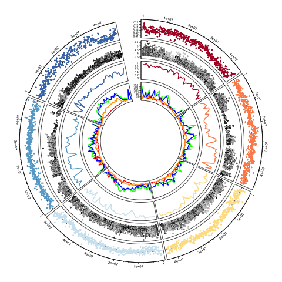

# Section 1 - Chromosome diversity


### Chromosome Colours to be used throughout the paper
```
c1 = 178,24,43  #b2182b
c2 = 252,141,89   #fc8d59
c3 = 254,224,144  #fee090
c4 = 209,229,240  #d1e5f0
c5 = 103,169,207  #67a9cf
c6 = 69,117,180  #4575b4
```


### R commands for generating the circos plot
```R
R
load(file = "hcontortus_genome.workbook.Rdata")
setwd("02_data/")
library(circlize)
library(cnv)

chr_colours<-c("#b2182b","#fc8d59","#fee090","#d1e5f0","#67a9cf","#4575b4")
chr<-read.table("HAEM_V4_final.chr.fa.genome",header=F)

gc_100k<-read.table("HAEM_V4_final.chr.fa.100k.nuc",skip = 1,header=F)
gc_100k<-gc_100k[(gc_100k$V5>0.41 & gc_100k$V5<0.5),]
line_1M<-read.table("LINE_repeats.1M.counts",header=F)
sine_1M<-read.table("SINE_repeats.1M.counts",header=F)
dna_1M<-read.table("DNA_repeats.1M.counts",header=F)
ltr_1M<-read.table("LTR_repeats.1M.counts",header=F)
haplotypes<-read.table("haplotype_hits_5k.coords2",header=T)
haplotypes<-haplotypes[haplotypes$similarity>0.2,]
haplotype_cov<-read.table("haplotype_hits_5k.1M.coverage2",header=F)


#pdf("figure1_circos.pdf",useDingbats = FALSE,height = 7,width = 7)
png("../04_analysis/figure1_circos.png")
circos.par("track.height" = 0.15,start.degree = 90 ,gap.degree=c(1,1,1,1,1,12))
circos.initialize(factors = chr$V1, x = chr$V2)


# Track 1 - GC_CONTENT
gc_mean<-mean(gc_100k$V5)
circos.track(ylim = c(0.41, 0.46),factors = gc_100k$V1, x=gc_100k$V2,y=gc_100k$V5,
             panel.fun = function(x, y) {
             circos.axis(labels.cex = 0.5,major.at = c(1,1e7,2e7,3e7,4e7,5e7))
             cell.xlim = get.cell.meta.data("cell.xlim")
             circos.lines(cell.xlim, c(gc_mean,gc_mean), col="black",lwd=1,lty="dashed")
               })
circos.trackPoints(factors = gc_100k$V1, x=gc_100k$V3, y=gc_100k$V5,pch = 20,cex = 0.5,col=chr_colours)
circos.yaxis(labels.cex=0.4,side = 'left',tick = T,sector.index = 'hcontortus_chr1_Celeg_TT_arrow_pilon')


# Track 2 - Haplotypes - length vs identity
rbPal <- colorRampPalette(c('lightgrey','black'))
haplotypes$Col <- rbPal(10)[as.numeric(cut(haplotypes$similarity,breaks = 10))]

circos.track(ylim = c(3.5,5.5),factors=haplotypes$chromosome, haplotypes$start, haplotypes$length)
#circos.rect(haplotypes$start,haplotypes$length,haplotypes$end,haplotypes$length,lty="solid",lwd=1)
circos.trackPoints(factors =haplotypes$chromosome, x=haplotypes$start, y=log10(haplotypes$length),pch = 20,cex = 0.5,col = haplotypes$Col)
circos.yaxis(labels.cex=0.4,side = 'left',tick = T,sector.index = 'hcontortus_chr1_Celeg_TT_arrow_pilon')

# Track 3 - haplotype - coverage per 1 Mb window
circos.track(ylim = c(0,1),factors=haplotype_cov$V1, haplotype_cov$V2, haplotype_cov$V7)
#circos.rect(haplotypes$start,haplotypes$length,haplotypes$end,haplotypes$length,lty="solid",lwd=1)
circos.trackLines(factors = haplotype_cov$V1, haplotype_cov$V3-500000, haplotype_cov$V7,col=chr_colours,lwd=2)
circos.yaxis(labels.cex=0.4,side = 'left',tick = T,sector.index = 'hcontortus_chr1_Celeg_TT_arrow_pilon')


# Track 4 - Repeats - LINEs, SINEs, DNA, LTRs
circos.track(factors=line_1M$V1, line_1M$V2, line_1M$V4)
circos.trackLines(factors = line_1M$V1,line_1M$V2, line_1M$V4,col="green",lwd=2)
circos.trackLines(factors = sine_1M$V1,sine_1M$V2, sine_1M$V4,col="red",lwd=2)
circos.trackLines(factors = dna_1M$V1,dna_1M$V2, dna_1M$V4,col="blue",lwd=2)
circos.trackLines(factors = ltr_1M$V1,ltr_1M$V2, ltr_1M$V4,col="orange",lwd=2)
circos.yaxis(labels.cex=0.4,side = 'left',tick = T,sector.index = 'hcontortus_chr1_Celeg_TT_arrow_pilon')


# finish
circos.clear()
dev.off()
```



Figure 1 - circos plot


## Haplotypes - dotplots of chromosomes vs haplotypes
```R
#
R
# R-3.5.0
load(file = "hcontortus_genome.workbook.Rdata")
setwd("02_data/")

library(ggplot2)


chr1_dotter<-read.table("hcontortus_chr1_Celeg_TT_arrow_pilon_vs_HAEM_V4_final.haplocomtam_only_renamed.layout.txt")
chr2_dotter<-read.table("hcontortus_chr2_Celeg_TT_arrow_pilon_vs_HAEM_V4_final.haplocomtam_only_renamed.layout.txt")
chr3_dotter<-read.table("hcontortus_chr3_Celeg_TT_arrow_pilon_vs_HAEM_V4_final.haplocomtam_only_renamed.layout.txt")
chr4_dotter<-read.table("hcontortus_chr4_Celeg_TT_arrow_pilon_vs_HAEM_V4_final.haplocomtam_only_renamed.layout.txt")
chr5_dotter<-read.table("hcontortus_chr5_Celeg_TT_arrow_pilon_vs_HAEM_V4_final.haplocomtam_only_renamed.layout.txt")
chrX_dotter<-read.table("hcontortus_chrX_Celeg_TT_arrow_pilon_vs_HAEM_V4_final.haplocomtam_only_renamed.layout.txt")

dat<-chr5_dotter
dat<-dat[dat$V17 > 5000, ]
tdat<-dat[dat$V17 > 5000,  ]

vdat<-aggregate(dat$V5, by=list(dat$V4), max)

ggplot()+
  geom_point(data=dat,aes(y=V2/1e6, x=V5/1e6, colour=V7),size=0.5)+
  theme_bw()+theme(legend.position="none")+xlim(0,50)
ggsave("chr_v_haplo_dotter_chr5_5k.pdf",height=3,width=3,useDingbats = FALSE)


### save image
save.image(file="hcontortus_genome.workbook.Rdata")
```
