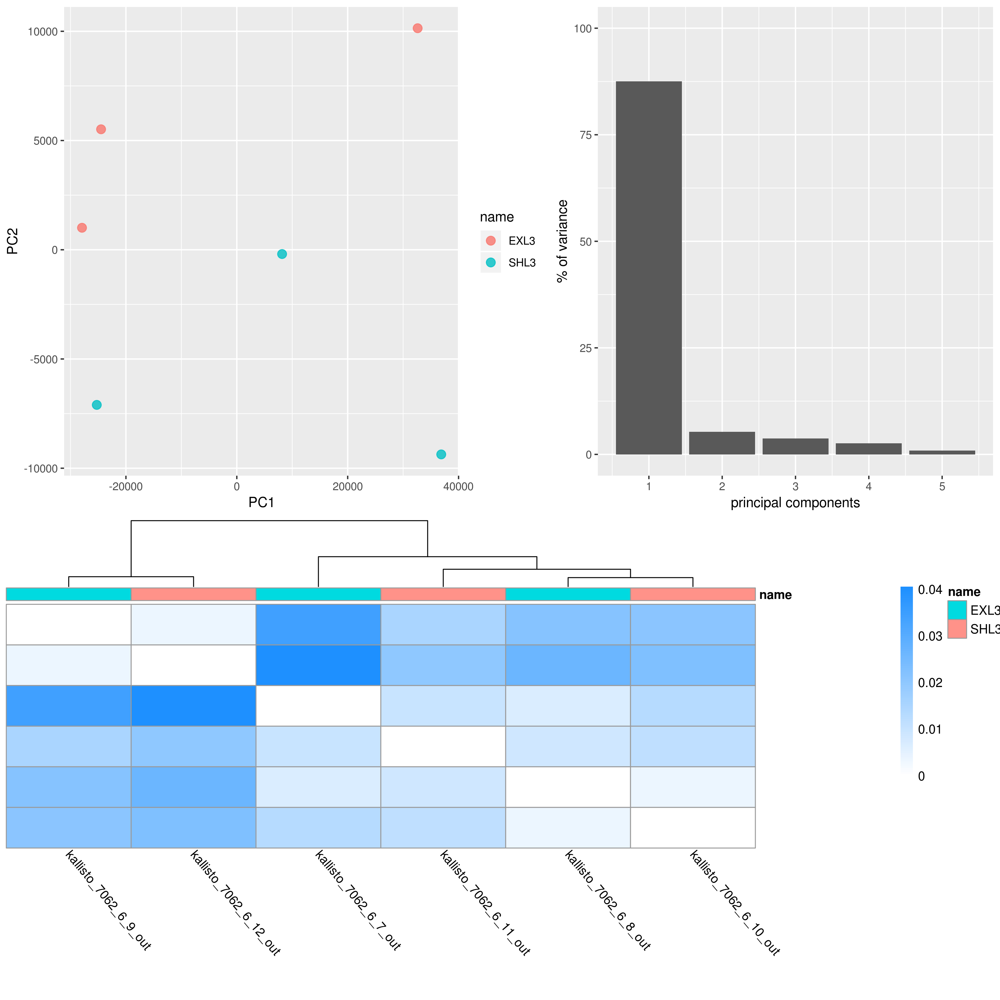
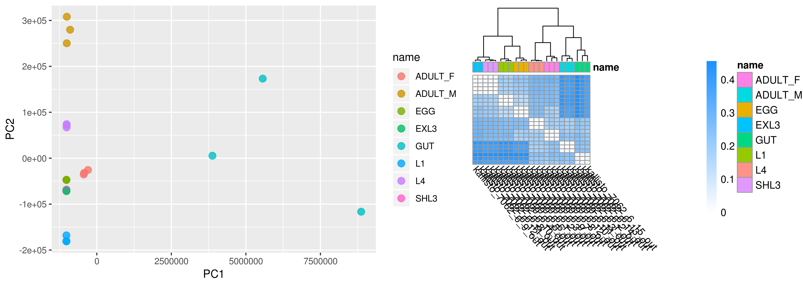
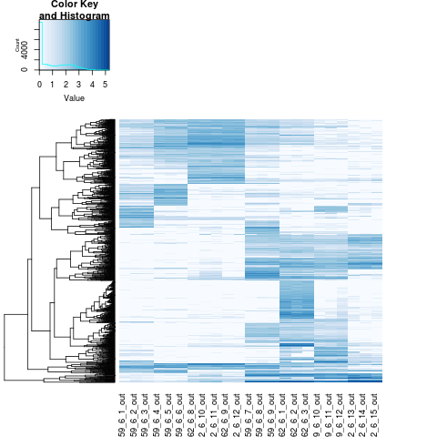

annotation# Haemonchus genome - transcriptome analyses

## Table of contents

1.
2.
3. [Manual Curation in Apollo](#manual_curation_apollo)
4. [Annotation QC](#annoation_qc)
5. [Kallisto](#kallisto)
6. [Differential splicing w Leafcutter](#ds_leafcutter)


## 03 - Manual Curation in Apollo <a name="manual_curation_apollo"></a>

The genome annotaiton has been maually curated in apollo.

Tracks used
- Genome annotaiton
- RNAseq per lifestage
- splice leaders (SL1 & SL2)
- Pacbio IsoSeq (CCS subreads and HQ isoforms)


Once out of Apollo, some curation needs to be done to clean things up a little. The main problem is that Apollo uses a unique code ID per feature to keep track of informaiton and to make sure there are no clashes in IDs. While this is important in Apollo, it makes it confusing in downstream analyses that use the annotaiton. Decided to replace these so they are consistent throughout the whole annotaiton.

*NOTE* this approach below will have to be modified for subsequent apollo updates to ensure consistent naming of features. Eg, if a new isoform is added.

### Working environment
```shell
/nfs/users/nfs_s/sd21/lustre118_link/hc/GENOME/TRANSCRIPTOME/TRANSCRIPTOME_CURATION

```


```shell
# make a copy to work on
mv hc_v4.gff3 HC_V4_WBP11plus_190118.gff3
ln -s HC_V4_WBP11plus_190118.gff3 tmp.gff

# get mRNAs IDs and NAMES
awk '$3=="mRNA" {print $0}' OFS="\t"  tmp.gff | sed -e 's/Note=Manually dissociate transcript from gene;//g' | cut -f3,5 -d ";" | sed -e 's/ID=//g' -e 's/;Name=/\t/g' > mRNA_IDs_NAMEs.txt

# remove transcript extensions
cat mRNA_IDs_NAMEs.txt | awk  '{ $2 = substr($2, 1,13); print }' OFS="\t" | sort -k2 > mRNA_IDs_NAMEs_trimmed-sorted.txt

# make a unique list
cut -f2  mRNA_IDs_NAMEs_trimmed-sorted.txt | uniq > mRNA_IDs_NAMEs_unique.txt

# add unique ID to each transcript
>mRNA_IDs_NAMEs_transcriptIDs.txt
while read NAME; do grep -w ${NAME} mRNA_IDs_NAMEs_trimmed-sorted.txt | cat -n | awk '{print $2,$3,$3"-0000"$1}' OFS="\t" >> mRNA_IDs_NAMEs_transcriptIDs.txt; done < mRNA_IDs_NAMEs_unique.txt

# run the real substitution
export PATH="/nfs/users/nfs_s/sd21/lustre118_link/software/anaconda2/bin:$PATH"
# fsed - https://github.com/wroberts/fsed
awk '{print $1,$3}' OFS="\t" mRNA_IDs_NAMEs_transcriptIDs.txt > mRNA_IDs_NAMEs_transcriptIDs.2.txt

fsed --pattern-format=tsv --output HCON_V4_WBP11plus_190118.renamed.gff3  mRNA_IDs_NAMEs_transcriptIDs.2.txt HCON_V4_WBP11plus_190118.gff3 &

```


Fixing GFF to prepare for interproscan. Stripping out info from existing interproscan, as is is incorrectly formatted.

```shell
sed -e 's/;info.*$//g' -e 's/method.*//g' -e '/^$/d' HCON_V4_WBP11plus_190118.renamed.gff3 > tmp.gff

echo '##FASTA' >> tmp.gff
ln -s ../../REF/HAEM_V4_final.chr.fa
cat tmp.gff HAEM_V4_final.chr.fa > tmp.gff2; mv tmp.gff2 tmp.gff
```

interproscan
```shell
# generate a protein fasta from annotation and reference genome
gffread -y PROTEINS.fa -g HAEM_V4_final.chr.fa HCON_V4_WBP11plus_190118.renamed.gff3
sed -e 's/\.//g' PROTEINS.fa > tmp; mv tmp PROTEINS.fa

# run interproscan
farm_interproscan -a PROTEINS.fa -o IPS.output.gff

# lift over GO terms from interproscan to GFF
extract_interproscan_go_terms -i IPS.output.gff -e tmp.gff

# rename
mv tmp.gff.go.gff HCON_V4_WBP11plus_190118.ips.gff3
```


---

---

## 03 - Annotation QC <a name="annotation_qc"></a>

Date 190116

Want to compare the final annotation to steps along the way. These include
- V1 genome vs manually curated V1 genes
_ V4 final vs AUGUSTUS
- V4 final vs BRAKER
- V4 final vs PASA w Isoseq R1
- V4 final vs EVM w Isoseq R2

Need to do this with the 110 manually curated genes, and the whole V4 final.

### Working environment
```shell
cd /nfs/users/nfs_s/sd21/lustre118_link/hc/GENOME/TRANSCRIPTOME
mkdir TRANSCRIPTOME_QC
cd TRANSCRIPTOME_QC
```


### Get some data
```shell
# V1 curated genes
cp /nfs/users/nfs_s/sd21/lustre118_link/hc/GENOME/V3/TRANSCRIPTOME/V1_MANUAL_CURATION/ABC_LGic.2.gff ABC_LGic.2.gff

# V1 GENOME
cp ~sd21/lustre118_link/REFERENCE_SEQUENCES/haemonchus_contortus/V1/haemonchus_contortus.PRJEB506.WBPS8.genomic.fa HCON_V1.fa

# V1 Genome annotation
cp /nfs/users/nfs_s/sd21/lustre118_link/hc/GENOME/V3/TRANSCRIPTOME/V1_MANUAL_CURATION/Hc_rztk_1+2+8+9.augustus.gff3 Hc_rztk_1+2+8+9.augustus.gff3

cp ~sd21/lustre118_link/REFERENCE_SEQUENCES/haemonchus_contortus/V1/haemonchus_contortus.PRJEB506.WBPS8.annotations.gff3 HCON_V1.annotation.gff3

# V4 final annotaiton
cp ~sd21/lustre118_link/hc/GENOME/TRANSCRIPTOME/TRANSCRIPTOME_CURATION/HCON_V4_WBP11plus_190118.ips.gff3 HCON_V4_FINAL.gff3

# V4 AUGUSTUS

# V4 BRAKER
cp /nfs/users/nfs_s/sd21/lustre118_link/hc/GENOME/TRANSCRIPTOME/BRAKER_CHR/braker/Hc_V4_chr/augustus.gff3 HCON_V4_BRAKER.gff3

# V4 PASA
cp /nfs/users/nfs_s/sd21/lustre118_link/hc/GENOME/TRANSCRIPTOME/PASA_CHR/sd21_pasa_HcV4_2.gene_structures_post_PASA_updates.18752.gff3 HCON_V4_PASA.gff3

# V4 EMV
cp /nfs/users/nfs_s/sd21/lustre118_link/hc/GENOME/TRANSCRIPTOME/PASA_CHR_R2/HCON_V4.renamed.gff3 HCON_V4_EVM.gff3
```


### Transcriptome comparisons
```shell
# V1 vs curated V1 genes
gffcompare -R -r ABC_LGic.2.gff -o V1cutated_vs_V1annotation Hc_rztk_1+2+8+9.augustus.gff3

# Result
#-----------------| Sensitivity | Precision  |
        Base level:    92.9     |     2.7    |
        Exon level:    86.3     |     2.6    |
      Intron level:    89.5     |     2.7    |
Intron chain level:    33.3     |     0.7    |
  Transcript level:    34.3     |     0.7    |

       Locus level:    34.8     |     0.8    |


# V4 Final vs BRAKER
gffcompare -R -r HCON_V4_FINAL.gff3 -o V4_FINAL_vs_BRAKER HCON_V4_BRAKER.gff3
# Result
#-----------------| Sensitivity | Precision  |
        Base level:    85.5     |    79.7    |
        Exon level:    89.7     |    86.7    |
      Intron level:    94.8     |    93.9    |
Intron chain level:    67.5     |    61.5    |
  Transcript level:    72.7     |    56.3    |

       Locus level:    78.0     |    60.6    |


# V4 Final vs PASA_CHR
gffcompare -R -r HCON_V4_FINAL.gff3 -o V4_FINAL_vs_PASA HCON_V4_PASA.gff3

#-----------------| Sensitivity | Precision  |
        Base level:    85.0     |    97.6    |
        Exon level:    89.7     |    95.4    |
      Intron level:    90.1     |    96.5    |
Intron chain level:    33.3     |    32.9    |

  Transcript level:    33.2     |    30.8    |
       Locus level:    30.3     |    29.8    |


# V4 Final vs EVM
gffcompare -R -r HCON_V4_FINAL.gff3 -o V4_FINAL_vs_EVM HCON_V4_EVM.gff3
#-----------------| Sensitivity | Precision  |
        Base level:    92.9     |    98.7    |
        Exon level:    94.8     |    96.2    |
      Intron level:    96.4     |    98.1    |
Intron chain level:    84.2     |    84.3    |
  Transcript level:    86.8     |    86.8    |

       Locus level:    87.6     |    86.5    |

```

Don't think it is worth including the V1 comparison, as these curated genes would have been incorporated into the final annotation. Not really a good comparison. V1 precision is low due to only a subset of genes being used.

Results suggest:
- no increase in sensitivity, but big increase in precision from BRAKER to PASA
- increase in Sensitivity and Precision from PASA to EVM


###### HACK - didn't use this in the end, but keeping for reference
- There are some additionaly lines contaminating the final gff, and so while that is being fixed, need a workaround to extract sd21_modified genes from final gff3
- plan: grep relevant mRNA lines, and extract mRNA name (HCON etc) and ID (apollo unique ID), and use this as a list to grep out relevant lines back out from the original GFF

```shell  
grep "^hcon" HCON_V4_FINAL.gff3 | awk '$3=="mRNA" {print $0}' OFS="\t"  | cut -f 9 | sed -e 's/=/\t/g' -e 's/;/\t/g' | awk '{print $6,$10}' OFS="\n" > sd21_genes.list

while read NAME; do grep "=$NAME;" HCON_V4_FINAL.gff3; done  < sd21_genes.list >  sd21_genes.gff
sort sd21_genes.gff | uniq > sd21_genes.uniq.gff
```


---
## 04 - Kallisto <a name="kallisto"></a>
---


Date 190116

Using Kallisto to quantify transcripts, and use in the gene expression clustering analyses.


### Working environment
```shell
cd /nfs/users/nfs_s/sd21/lustre118_link/hc/GENOME/TRANSCRIPTOME
mkdir KALLISTO
cd KALLISTO
```


### Get the GFF to work on
```shell
ln -s /nfs/users/nfs_s/sd21/lustre118_link/hc/GENOME/REF/HAEM_V4_final.chr.fa REF.fa
ln -s /nfs/users/nfs_s/sd21/lustre118_link/hc/GENOME/TRANSCRIPTOME/TRANSCRIPTOME_CURATION/HCON_V4_WBP11plus_190118.ips.gff3 ANNOTATION.gff3
```

### get some raw data
```shell
cd ~/lustre118_link/hc/GENOME/TRANSCRIPTOME/RAW

kinit # log into iRODs
icd /seq/7059
ils | grep "7059_6" | grep -v "phi" | while read -r name; do iget /seq/7059/${name} . ; done
ils | grep "7062_6" | grep -v "phi" | while read -r name; do iget /seq/7062/${name} . ; done
rm *168.ba* 7059_6#0.bam 7062_6#0.bam

# convert bam to fastqs
for i in *.bam; do samtools fastq -1 ${i%.bam}_1.fastq.gz -2 ${i%.bam}_2.fastq.gz ${i}; done
rm *.bam
rename "s/#/_/g" *
```


### Run Kallisto
```shell
cd /nfs/users/nfs_s/sd21/lustre118_link/hc/GENOME/TRANSCRIPTOME/KALLISTO

# make a transcripts fasta
gffread -x TRANSCRIPTS.fa -g REF.fa ANNOTATION.gff3


# index the transcripts
kallisto index --index HCON_V4.TRANSCRIPTS.ixd TRANSCRIPTS.fa

# run kallisto
for i in ` cd ../RAW/ ; ls -1 *_1.fastq.gz | sed -e "s/_1.fastq.gz//g" `; do \
kallisto quant \
--bias \
--index HCON_V4.TRANSCRIPTS.ixd \
--output-dir kallisto_${i}_out \
--bootstrap-samples 100 \
--threads 7 \
--fusion \
../RAW/${i}_1.fastq.gz ../RAW/${i}_2.fastq.gz; done

mkdir KALLISTO_MAPPED_SAMPLES
mv kallisto_* KALLISTO_MAPPED_SAMPLES/

```

To run sleuth, a metadata file is needed with all samples IDs, conditions, and paths.


### Load R and environment

```R

R-3.5.0
#load(file = "hcontortus_genome.workbook.Rdata")
library("sleuth")
library(ggplot2)
library(patchwork)
```

### Run Sleuth
```R
hc_metadata <- read.table("sample_name_path.list", header = TRUE, stringsAsFactors=FALSE)
hc_so <- sleuth_prep(hc_metadata, extra_bootstrap_summary = TRUE)
hc_so <- sleuth_fit(hc_so, ~name, 'full')
hc_so <- sleuth_fit(hc_so, ~1, 'reduced')
hc_so <- sleuth_lrt(hc_so, 'reduced', 'full')

sleuth_table <- sleuth_results(hc_so, 'reduced:full', 'lrt', show_all = FALSE)
sleuth_significant <- dplyr::filter(sleuth_table, qval <= 0.05)
head(sleuth_significant, 20)
```

Generate some plots for QC
```R
pcaplot_allsamples	<-	plot_pca(hc_so, color_by = 'name')
heatmap_allsamples   <-    plot_sample_heatmap(hc_so)


# PCA of all samples shows gut a both variable and outlier - will remove just to have a look
hc_so_noGUT_meta   <-    hc_metadata[(hc_metadata$name!="GUT"),]
hc_so_noGUT   <-    sleuth_prep(hc_so_noGUT_meta, extra_bootstrap_summary = TRUE)
hc_so_noGUT   <-    sleuth_fit(hc_so_noGUT, ~name, 'full')
hc_so_noGUT   <-    sleuth_fit(hc_so_noGUT, ~1, 'reduced')
hc_so_noGUT   <-    sleuth_lrt(hc_so_noGUT, 'reduced', 'full')

pcaplot_allsamples_minusgut	<-	plot_pca(hc_so_noGUT, color_by = 'name')


# PCA of L3 samples - SHL3 and EXL3
hc_so_L3_meta    <-    hc_metadata[(hc_metadata$name=="EXL3" | hc_metadata$name=="SHL3"),]
hc_so_L3    <-    sleuth_prep(hc_so_L3_meta, extra_bootstrap_summary = TRUE)
hc_so_L3    <-    sleuth_fit(hc_so_L3, ~name, 'full')
hc_so_L3    <-    sleuth_fit(hc_so_L3, ~1, 'reduced')
hc_so_L3    <-    sleuth_lrt(hc_so_L3, 'reduced', 'full')


pcaplot_L3	<-	plot_pca(hc_so_L3, color_by = 'name')
pc_varianceplot_L3    <-    plot_pc_variance(hc_so_L3)
heatmap_L3   <-    plot_sample_heatmap(hc_so_L3)

# patchwork
kallistoQC_L3_plots <- (pcaplot_L3 | pc_varianceplot_L3) / heatmap_L3 + plot_layout(ncol = 1)
ggsave("kallistoQC_L3_plots.pdf",width = 28, height = 28, units = "cm")
ggsave("kallistoQC_L3_plots.png",width = 28, height = 28, units = "cm")

```
- Copy to local dir - run this from local machine
```shell
scp sd21@pcs5.internal.sanger.ac.uk:/nfs/users/nfs_s/sd21/lustre118_link/hc/GENOME/TRANSCRIPTOME/KALLISTO/kallistoQC_L3_plots.png ~/Documents/workbook/hcontortus_genome/04_analysis
```


Fig - Kalliso QC - L3 QC plots (i) PCA (ii) Loading plot of each PC, (iii) Heatmap


Because the the L3 samples have been mixed, need to regenerate the metadata file to reflect the switch of L3 IDs. The new IDs are as follows:
- SHL3
    - 7062_6_10
    - 7062_6_8
    - 7062_6_11
    - 7062_6_7 (probable - may drop)
- EXL3
    - 7062_6_12
    - 7062_6_9

Made a new file called "sample_name_path_L3fixed.list" with correct IDs, paths


```R
R-3.5.0
#load(file = "hcontortus_genome.workbook.Rdata")
library("sleuth")
library(ggplot2)
library(patchwork)

hc_metadata_L3fixed   <-    read.table("sample_name_path_L3fixed.list", header = TRUE, stringsAsFactors=FALSE)
hc_so   <-    sleuth_prep(hc_metadata_L3fixed, extra_bootstrap_summary = TRUE)
hc_so   <-    sleuth_fit(hc_so, ~name, 'full')
hc_so   <-    sleuth_fit(hc_so, ~1, 'reduced')
hc_so   <-    sleuth_lrt(hc_so, 'reduced', 'full')

sleuth_table    <-    sleuth_results(hc_so, 'reduced:full', 'lrt', show_all = FALSE)
sleuth_significant    <-    dplyr::filter(sleuth_table, qval <= 0.05)
head(sleuth_significant, 20)

pcaplot_allsamples2	<-	plot_pca(hc_so, color_by = 'name')
heatmap_allsamples2   <-    plot_sample_heatmap(hc_so)
kallistoQC_allsamples2_plots <- pcaplot_allsamples2 + heatmap_allsamples2 + plot_layout(ncol = 2)
ggsave("kallistoQC_allsamples2_plots.pdf",width = 28, height = 10, units = "cm")
ggsave("kallistoQC_allsamples2_plots.png",width = 28, height = 10, units = "cm")
```
- Copy to local dir - run this from local machine
```shell
scp sd21@pcs5.internal.sanger.ac.uk:/nfs/users/nfs_s/sd21/lustre118_link/hc/GENOME/TRANSCRIPTOME/KALLISTO/kallistoQC_allsamples2_plots.png ~/Documents/workbook/hcontortus_genome/04_analysis
```


Fig - Kalliso QC - All samples with L3 IDs fixed


### Run pairwise comparisons
Want to generate tables of most significantly DE genes per pair, comparing sensible transitions throughout the life cycle

```R
# EGG vs L1 only
hc_so_EGGvL1	<-	hc_metadata_L3fixed[(hc_metadata_L3fixed$name=="EGG" | hc_metadata_L3fixed$name=="L1"),]
hc_so_EGGvL1 <- sleuth_prep(hc_so_EGGvL1, extra_bootstrap_summary = TRUE,num_cores=1)
hc_so_EGGvL1 <- sleuth_fit(hc_so_EGGvL1, ~name, 'full')
hc_so_EGGvL1 <- sleuth_fit(hc_so_EGGvL1, ~1, 'reduced')
hc_so_EGGvL1 <- sleuth_lrt(hc_so_EGGvL1, 'reduced', 'full')

sleuth_table_EGGvL1 <- sleuth_results(hc_so_EGGvL1, 'reduced:full', 'lrt', show_all = FALSE)
#sleuth_significant_EGGvL1 <- dplyr::filter(sleuth_table_EGGvL1, qval <= 0.05)
#head(sleuth_significant_EGGvL1, 20)

write.table(sleuth_table_EGGvL1,file="sleuth_table_EGGvL1.txt",sep="\t",quote=FALSE, row.names=FALSE)

#sleuth_live(hc_so_EGGvL1)

hc_so_EGGvL1_wt<-sleuth_wt(hc_so_EGGvL1,'nameL1',which_model = "full")
sleuth_table_EGGvL1_wt <- sleuth_results(hc_so_EGGvL1_wt,test="nameL1",which_model = "full",test_type = 'wt')
#sleuth_significant_EGGvL1_wt <- dplyr::filter(sleuth_table_EGGvL1_wt, qval <= 0.05)
#head(sleuth_significant_EGGvL1_wt, 100)


# L1 vs SHL3
hc_so_L1vSHL3_meta	<-	hc_metadata_L3fixed[(hc_metadata_L3fixed$name=="L1" | hc_metadata_L3fixed$name=="SHL3"),]
hc_so_L1vSHL3 <- sleuth_prep(hc_so_L1vSHL3_meta, extra_bootstrap_summary = TRUE,num_cores=1)
hc_so_L1vSHL3 <- sleuth_fit(hc_so_L1vSHL3, ~name, 'full')
hc_so_L1vSHL3 <- sleuth_fit(hc_so_L1vSHL3, ~1, 'reduced')
hc_so_L1vSHL3 <- sleuth_lrt(hc_so_L1vSHL3, 'reduced', 'full')

sleuth_table_L1vSHL3 <- sleuth_results(hc_so_L1vSHL3, 'reduced:full', 'lrt', show_all = FALSE)
#sleuth_significant_L1vSHL3 <- dplyr::filter(sleuth_table_L1vSHL3, qval <= 0.05)
#head(sleuth_significant_L1vSHL3, 20)

write.table(sleuth_table_L1vSHL3,file="sleuth_table_L1vSHL3.txt",sep="\t",quote=FALSE, row.names=FALSE)


hc_so_L1vSHL3_wt<-sleuth_wt(hc_so_L1vSHL3,'nameSHL3',which_model = "full")
sleuth_table_L1vSHL3_wt <- sleuth_results(hc_so_L1vSHL3_wt,test="nameSHL3",which_model = "full",test_type = 'wt')
sleuth_significant_L1vSHL3_wt <- dplyr::filter(sleuth_table_L1vSHL3_wt, qval <= 0.05)
#head(sleuth_significant_L1vSHL3_wt, 100)


# SHL3 vs EXL3
hc_so_SHL3vEXL3	<-	hc_metadata_L3fixed[(hc_metadata_L3fixed$name=="SHL3" | hc_metadata_L3fixed$name=="EXL3"),]
hc_so_SHL3vEXL3 <- sleuth_prep(hc_so_SHL3vEXL3, extra_bootstrap_summary = TRUE,num_cores=1)
hc_so_SHL3vEXL3 <- sleuth_fit(hc_so_SHL3vEXL3, ~name, 'full')
hc_so_SHL3vEXL3 <- sleuth_fit(hc_so_SHL3vEXL3, ~1, 'reduced')
hc_so_SHL3vEXL3 <- sleuth_lrt(hc_so_SHL3vEXL3, 'reduced', 'full')

sleuth_table_SHL3vEXL3 <- sleuth_results(hc_so_SHL3vEXL3, 'reduced:full', 'lrt', show_all = FALSE)
#sleuth_significant_SHL3vEXL3 <- dplyr::filter(sleuth_table_SHL3vEXL3, qval <= 0.05)
#head(sleuth_significant_SHL3vEXL3, 20)

write.table(sleuth_table_SHL3vEXL3,file="sleuth_table_SHL3vEXL3.txt",sep="\t",quote=FALSE, row.names=FALSE)


hc_so_SHL3vEXL3_wt<-sleuth_wt(hc_so_SHL3vEXL3,'nameSHL3',which_model = "full")
sleuth_table_SHL3vEXL3_wt <- sleuth_results(hc_so_SHL3vEXL3_wt,test="nameSHL3",which_model = "full",test_type = 'wt')
sleuth_significant_SHL3vEXL3_wt <- dplyr::filter(sleuth_table_SHL3vEXL3_wt, qval <= 0.05)
head(sleuth_significant_SHL3vEXL3_wt, 100)


# EXL3 vs L4
hc_so_EXL3vL4	<-	hc_metadata_L3fixed[(hc_metadata_L3fixed$name=="EXL3" | hc_metadata_L3fixed$name=="L4"),]
hc_so_EXL3vL4 <- sleuth_prep(hc_so_EXL3vL4, extra_bootstrap_summary = TRUE,num_cores=1)
hc_so_EXL3vL4 <- sleuth_fit(hc_so_EXL3vL4, ~name, 'full')
hc_so_EXL3vL4 <- sleuth_fit(hc_so_EXL3vL4, ~1, 'reduced')
hc_so_EXL3vL4 <- sleuth_lrt(hc_so_EXL3vL4, 'reduced', 'full')

sleuth_table_EXL3vL4 <- sleuth_results(hc_so_EXL3vL4, 'reduced:full', 'lrt', show_all = FALSE)
#sleuth_significant_EXL3vL4 <- dplyr::filter(sleuth_table_EXL3vL4, qval <= 0.05)
#head(sleuth_significant_EXL3vL4, 20)

write.table(sleuth_table_EXL3vL4,file="sleuth_table_EXL3vL4.txt",sep="\t",quote=FALSE, row.names=FALSE)


hc_so_EXL3vL4_wt<-sleuth_wt(hc_so_EXL3vL4,'nameL4',which_model = "full")
sleuth_table_EXL3vL4_wt <- sleuth_results(hc_so_EXL3vL4_wt,test="nameL4",which_model = "full",test_type = 'wt')
sleuth_significant_EXL3vL4_wt <- dplyr::filter(sleuth_table_EXL3vL4_wt, qval <= 0.05)
head(sleuth_significant_EXL3vL4_wt, 100)


# L4 vs Adult Male
hc_so_L4vADULTM	<-	hc_metadata_L3fixed[(hc_metadata_L3fixed$name=="L4" | hc_metadata_L3fixed$name=="ADULT_M"),]
hc_so_L4vADULTM <- sleuth_prep(hc_so_L4vADULTM, extra_bootstrap_summary = TRUE,num_cores=1)
hc_so_L4vADULTM <- sleuth_fit(hc_so_L4vADULTM, ~name, 'full')
hc_so_L4vADULTM <- sleuth_fit(hc_so_L4vADULTM, ~1, 'reduced')
hc_so_L4vADULTM <- sleuth_lrt(hc_so_L4vADULTM, 'reduced', 'full')

sleuth_table_L4vADULTM <- sleuth_results(hc_so_L4vADULTM, 'reduced:full', 'lrt', show_all = FALSE)
#sleuth_significant_L4vADULTM <- dplyr::filter(sleuth_table_L4vADULTM, qval <= 0.05)
#head(sleuth_significant_L4vADULTM, 20)

write.table(sleuth_table_L4vADULTM,file="sleuth_table_L4vADULTM.txt",sep="\t",quote=FALSE, row.names=FALSE)


hc_so_L4vADULTM_wt<-sleuth_wt(hc_so_L4vADULTM,'nameL4',which_model = "full")
sleuth_table_L4vADULTM_wt <- sleuth_results(hc_so_L4vADULTM_wt,test="nameL4",which_model = "full",test_type = 'wt')
sleuth_significant_L4vADULTM_wt <- dplyr::filter(sleuth_table_L4vADULTM_wt, qval <= 0.05)
head(sleuth_significant_L4vADULTM_wt, 100)


# L4 vs Adult Female
hc_so_L4vADULTF	<-	hc_metadata_L3fixed[(hc_metadata_L3fixed$name=="L4" | hc_metadata_L3fixed$name=="ADULT_F"),]
hc_so_L4vADULTF <- sleuth_prep(hc_so_L4vADULTF, extra_bootstrap_summary = TRUE,num_cores=1)
hc_so_L4vADULTF <- sleuth_fit(hc_so_L4vADULTF, ~name, 'full')
hc_so_L4vADULTF <- sleuth_fit(hc_so_L4vADULTF, ~1, 'reduced')
hc_so_L4vADULTF <- sleuth_lrt(hc_so_L4vADULTF, 'reduced', 'full')

sleuth_table_L4vADULTF <- sleuth_results(hc_so_L4vADULTF, 'reduced:full', 'lrt', show_all = FALSE)
#sleuth_significant_L4vADULTF <- dplyr::filter(sleuth_table_L4vADULTF, qval <= 0.05)
#head(sleuth_significant_L4vADULTF, 20)

write.table(sleuth_table_L4vADULTF,file="sleuth_table_L4vADULTF.txt",sep="\t",quote=FALSE, row.names=FALSE)


hc_so_L4vADULTF_wt<-sleuth_wt(hc_so_L4vADULTF,'nameL4',which_model = "full")
sleuth_table_L4vADULTF_wt <- sleuth_results(hc_so_L4vADULTF_wt,test="nameL4",which_model = "full",test_type = 'wt')
sleuth_significant_L4vADULTF_wt <- dplyr::filter(sleuth_table_L4vADULTF_wt, qval <= 0.05)
head(sleuth_significant_L4vADULTF_wt, 100)


# Adult Male vs Adult Female
hc_so_ADULTMvADULTF	<-	hc_metadata_L3fixed[(hc_metadata_L3fixed$name=="ADULT_M" | hc_metadata_L3fixed$name=="ADULT_F"),]
hc_so_ADULTMvADULTF <- sleuth_prep(hc_so_ADULTMvADULTF, extra_bootstrap_summary = TRUE,num_cores=1)
hc_so_ADULTMvADULTF <- sleuth_fit(hc_so_ADULTMvADULTF, ~name, 'full')
hc_so_ADULTMvADULTF <- sleuth_fit(hc_so_ADULTMvADULTF, ~1, 'reduced')
hc_so_ADULTMvADULTF <- sleuth_lrt(hc_so_ADULTMvADULTF, 'reduced', 'full')

sleuth_table_ADULTMvADULTF <- sleuth_results(hc_so_ADULTMvADULTF, 'reduced:full', 'lrt', show_all = FALSE)
#sleuth_significant_ADULTMvADULTF <- dplyr::filter(sleuth_table_ADULTMvADULTF, qval <= 0.05)
#head(sleuth_significant_ADULTMvADULTF, 20)

write.table(sleuth_table_ADULTMvADULTF,file="sleuth_table_ADULTMvADULTF.txt",sep="\t",quote=FALSE, row.names=FALSE)


hc_so_ADULTMvADULTF_wt<-sleuth_wt(hc_so_ADULTMvADULTF,'nameADULT_M',which_model = "full")
sleuth_table_ADULTMvADULTF_wt <- sleuth_results(hc_so_ADULTMvADULTF_wt,test="nameADULT_M",which_model = "full",test_type = 'wt')
sleuth_significant_ADULTMvADULTF_wt <- dplyr::filter(sleuth_table_ADULTMvADULTF_wt, qval <= 0.05)
head(sleuth_significant_ADULTMvADULTF_wt, 100)


# Adult Female vs Gut
hc_so_ADULTFvGUT	<-	hc_metadata_L3fixed[(hc_metadata_L3fixed$name=="ADULT_F" | hc_metadata_L3fixed$name=="GUT"),]
hc_so_ADULTFvGUT <- sleuth_prep(hc_so_ADULTFvGUT, extra_bootstrap_summary = TRUE,num_cores=1)
hc_so_ADULTFvGUT <- sleuth_fit(hc_so_ADULTFvGUT, ~name, 'full')
hc_so_ADULTFvGUT <- sleuth_fit(hc_so_ADULTFvGUT, ~1, 'reduced')
hc_so_ADULTFvGUT <- sleuth_lrt(hc_so_ADULTFvGUT, 'reduced', 'full')

sleuth_table_ADULTFvGUT <- sleuth_results(hc_so_ADULTFvGUT, 'reduced:full', 'lrt', show_all = FALSE)
#sleuth_significant_ADULTFvGUT <- dplyr::filter(sleuth_table_ADULTFvGUT, qval <= 0.05)
#head(sleuth_significant_ADULTFvGUT, 20)

write.table(sleuth_table_ADULTFvGUT,file="sleuth_table_ADULTFvGUT.txt",sep="\t",quote=FALSE, row.names=FALSE)


hc_so_ADULTFvGUT_wt<-sleuth_wt(hc_so_ADULTFvGUT,'nameADULT_F',which_model = "full")
sleuth_table_ADULTFvGUT_wt <- sleuth_results(hc_so_ADULTFvGUT_wt,test="nameADULT_F",which_model = "full",test_type = 'wt')
sleuth_significant_ADULTFvGUT_wt <- dplyr::filter(sleuth_table_ADULTFvGUT_wt, qval <= 0.05)
head(sleuth_significant_ADULTFvGUT_wt, 100)


# Adult Female vs Egg
hc_so_ADULTFvEGG	<-	hc_metadata_L3fixed[(hc_metadata_L3fixed$name=="EGG" | hc_metadata_L3fixed$name=="L1"),]
hc_so_ADULTFvEGG <- sleuth_prep(hc_so_ADULTFvEGG, extra_bootstrap_summary = TRUE,num_cores=1)
hc_so_ADULTFvEGG <- sleuth_fit(hc_so_ADULTFvEGG, ~name, 'full')
hc_so_ADULTFvEGG <- sleuth_fit(hc_so_ADULTFvEGG, ~1, 'reduced')
hc_so_ADULTFvEGG <- sleuth_lrt(hc_so_ADULTFvEGG, 'reduced', 'full')

sleuth_table_ADULTFvEGG <- sleuth_results(hc_so_ADULTFvEGG, 'reduced:full', 'lrt', show_all = FALSE)
#sleuth_significant_ADULTFvEGG <- dplyr::filter(sleuth_table_ADULTFvEGG, qval <= 0.05)
#head(sleuth_significant_ADULTFvEGG, 20)

write.table(sleuth_table_ADULTFvEGG,file="sleuth_table_ADULTFvEGG.txt",sep="\t",quote=FALSE, row.names=FALSE)


hc_so_ADULTFvEGG	<-	sleuth_wt(hc_so_ADULTFvEGG,'name',which_model = "full")
sleuth_table_ADULTFvEGG_wt	<-	sleuth_results(hc_so_ADULTFvEGG_wt,test="nameADULT_F",which_model = "full",test_type = 'wt')
sleuth_significant_ADULTFvEGG_wt <- dplyr::filter(sleuth_table_ADULTFvEGG_wt, qval <= 0.05)
head(sleuth_significant_ADULTFvEGG_wt, 100)


save.image(file = "hc_genome_kallisto.RData")
```


# make a heatmap of top 1000 variable genes across all life stages

```shell
cd /nfs/users/nfs_s/sd21/lustre118_link/hc/GENOME/TRANSCRIPTOME/KALLISTO/KALLISTO_MAPPED_SAMPLES
```

### generate the tpm data
```shell
# extract TPMs per sample
for i in ` ls -1d *out `; do echo $i > ${i}.tpm ; cat ${i}/abundance.tsv | cut -f5 | sed '1d' >> ${i}.tpm; done

# generate a "transcripts" list, taken from the TRANSCRIPTS.fa file
#echo "ID" > transcripts.list; grep ">" ../TRANSCRIPTS.fa | cut -f1 -d  " " | sed 's/>//g' >> transcripts.list
# due to Apollo giving long unique codes, the transcript IDs are obscure. Here is the fix
#awk '$3=="mRNA" {print $9}' ../ANNOTATION.gff3 | cut -f3,5 -d";" | sed -e 's/ID=//g' -e 's/;Name=/\t/g' > mRNA_IDtoNAME_conversion.txt

#while read ID NAME; do sed -i "s/${ID}/${NAME}/g" transcripts.list; done < mRNA_IDtoNAME_conversion.txt &

# ALTERNATE WAY, direct from the annotaiton
echo "ID" > transcripts.list; awk '$3=="mRNA" {print $9}' ../ANNOTATION.gff3 | cut -f5 -d";" | sed -e 's/Name=//g' >> transcripts.list


# make a data frame containing all TMP values from all samples
paste transcripts.list \
kallisto_7059_6_1_out.tpm \
kallisto_7059_6_2_out.tpm \
kallisto_7059_6_3_out.tpm \
kallisto_7059_6_4_out.tpm \
kallisto_7059_6_5_out.tpm \
kallisto_7059_6_6_out.tpm \
kallisto_7062_6_8_out.tpm \
kallisto_7062_6_10_out.tpm \
kallisto_7062_6_11_out.tpm \
kallisto_7062_6_9_out.tpm \
kallisto_7062_6_12_out.tpm \
kallisto_7059_6_7_out.tpm \
kallisto_7059_6_8_out.tpm \
kallisto_7059_6_9_out.tpm \
kallisto_7062_6_1_out.tpm \
kallisto_7062_6_2_out.tpm \
kallisto_7062_6_3_out.tpm \
kallisto_7059_6_10_out.tpm \
kallisto_7059_6_11_out.tpm \
kallisto_7059_6_12_out.tpm \
kallisto_7062_6_13_out.tpm \
kallisto_7062_6_14_out.tpm \
kallisto_7062_6_15_out.tpm \
> kallisto_allsamples.tpm.table

#kallisto_7062_6_7_out.tpm  has been removed
```

Curate the data, including:
  - setting minimum TMP at 1
  - transforming to log10 scale
  - calculating variance per row, of which the top 1000 most variable rows are selected
  - plot heatmap, of most variable transcripts


```R
R-3.5.0
library(gplots)
library(tibble)
library(RColorBrewer)

data<-read.table("kallisto_allsamples.tpm.table",header=T,row.names=1)

# set a TPM cutoff,
data<-(data > 1) * (data - 1) + 1
data<-log10(data)
data<-as.matrix(data)

# fix infinite values to NA
is.na(data) <- sapply(data, is.infinite)

# calculate variance per row
#https://stackoverflow.com/questions/25099825/row-wise-variance-of-a-matrix-in-r
RowVar <- function(x, ...) {
  rowSums(na.rm=TRUE,(x - rowMeans(x, ...))^2, ...)/(dim(x)[2] - 1)
}
var<-as.matrix(RowVar(data))
var<-as.data.frame(var)
var <- var[order(var), ,drop = FALSE]
var_filter <- tail(var,1000)   # set number of genes here
var_filter <- rownames_to_column(var_filter)

# bring all data together
data<-as.data.frame(data)
data<-rownames_to_column(data)

data_filtered <- dplyr::semi_join(data, var_filter, by = "rowname")
data_filtered <- column_to_rownames(data_filtered,'rowname')
data_filtered<-as.matrix(data_filtered)
#var<-as.matrix(RowVar(data))
#data<-cbind(data, variance = var )

# make heatmap
pdf("top1000variablegenes_allstages_minTPM1.pdf")
heatmap.2(data_filtered,trace="none",na.color="grey",labRow=F,dendrogram='row',Colv=FALSE,col= colorRampPalette(brewer.pal(8, "Blues"))(25))
dev.off()

png("top1000variablegenes_allstages_minTPM1.png")
heatmap.2(data_filtered,trace="none",na.color="grey",labRow=F,dendrogram='row',Colv=FALSE,col= colorRampPalette(brewer.pal(8, "Blues"))(25))
dev.off()

```

- Copy to local dir - run this from local machine
```shell
scp sd21@pcs5.internal.sanger.ac.uk:/nfs/users/nfs_s/sd21/lustre118_link/hc/GENOME/TRANSCRIPTOME/KALLISTO/KALLISTO_MAPPED_SAMPLES/top1000variablegenes_allstages_minTPM1.png ~/Documents/workbook/hcontortus_genome/04_analysis
```


Fig - Kalliso  top 1000 most variable genes across lifestages


### Run clustering analysis of gene expression across the life stages


Need to generate a replicates file that tells CLUST what samples to group.

### collate data for clust
```shell
mkdir clust_data
cp kallisto_allsamples.tpm.table clust_data/
```

Run clust
- requires a replicates dataset - see "replicates.txt"

```shell
# run clust
clust $PWD/clust_data -r replicates.txt
```
Clust produces a cluster profile PDF containing all Clusters. However, it is not that nice, and so will make better onces using ggplot. Need to convert PDF to PNG to post however.

```shell
# pdf to png conversion
convert Clusters_profiles.pdf -quality 200  Clusters_profiles.png
```

- Copy to local dir - run this from local machine
```shell
scp sd21@pcs5.internal.sanger.ac.uk:/nfs/users/nfs_s/sd21/lustre118_link/hc/GENOME/TRANSCRIPTOME/KALLISTO/KALLISTO_MAPPED_SAMPLES/Results_19_Jan_19/Clusters_profiles*.png ~/Documents/workbook/hcontortus_genome/04_analysis/
```


Fig - Clust - correlated gene expression across lifestages


Make nice clust plots using ggplot2
```shell
cd /nfs/users/nfs_s/sd21/lustre118_link/hc/GENOME/TRANSCRIPTOME/KALLISTO/KALLISTO_MAPPED_SAMPLES/Results_19_Jan_19

# make gene lists for each cluster set
for i in {1..20}; do cut -f "${i}" Clusters_Objects.tsv | sed '2d' | cut -f1 -d " " | sed '/^$/d' > cluster_${i}.list; done
```
```R
R-3.5.0
library(dplyr)
library(reshape2)
library(ggplot2)
library(gtools)

myFiles <- list.files(pattern="*.list")
myFiles <- mixedsort(sort(myFiles))   # get files in order
data<-read.table("Processed_Data/kallisto_allsamples.tpm.table_processed.tsv",header=T)


c0<-read.table("c1.list",header=T)

for(i in 1:length(myFiles)){
		cluster_data <- read.table(myFiles[i],header=TRUE)
		data<-read.table("Processed_Data/kallisto_allsamples.tpm.table_processed.tsv",header=T)
		data_cluster<-dplyr::semi_join(data, cluster_data, by = c("Genes" = colnames(cluster_data[1])))
		df_melted <- melt(data_cluster, id.vars = 'Genes')
  		ggplot()+geom_line(aes(df_melted$variable,df_melted$value,group = df_melted$Genes),alpha=0.1)+theme_bw()+ylab("Normalised TMP")+ylim(-2.5,2.5)
		ggsave(paste("cluster",i,".pdf",sep=""),width = 6, height = 6, units = c("cm"))
}

# example plot - c0
data_c0<-dplyr::semi_join(data, c0, by = c("Genes" = "C0"))
df_melted <- melt(data_c0, id.vars = 'Genes')
ggplot()+geom_line(aes(df_melted$variable,df_melted$value,group = df_melted$Genes),alpha=0.1)+theme_bw()

```


---
## 05 - Differential splicing w Leafcutter <a name="ds_leafcutter"></a>
---
