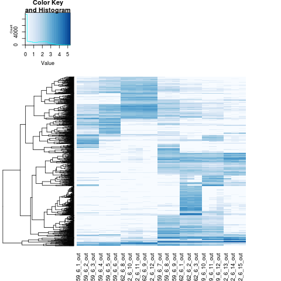
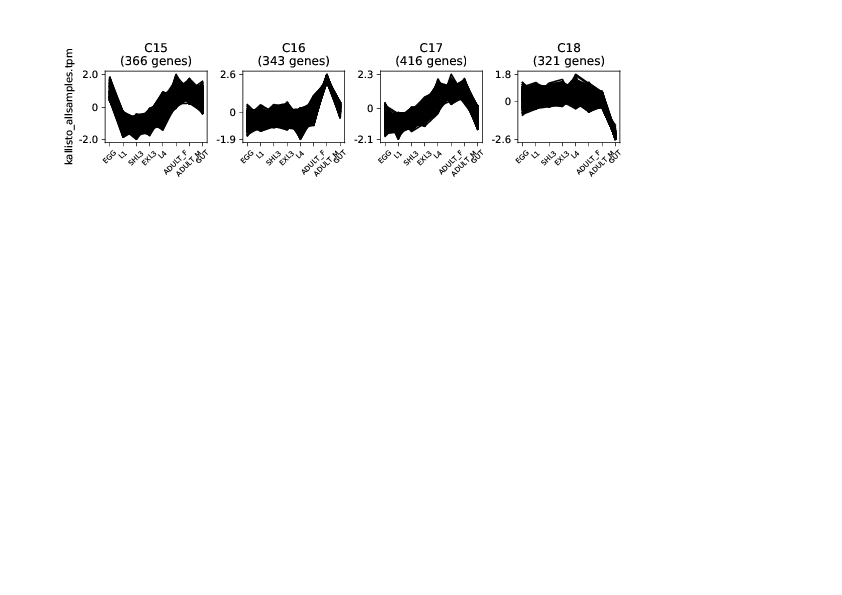
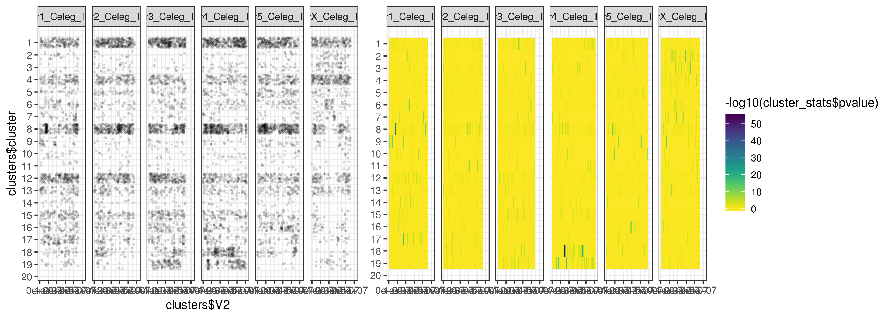

annotation# Haemonchus genome - transcriptome analyses

## Table of contents

1.
2.
3. [Manual Curation in Apollo](#manual_curation_apollo)
4. [Annotation QC](#annoation_qc)
5. [Gene model plots](#gene_model_plotter)
6. [Orthology](#orthology)
7. [Kallisto](#kallisto)
8. [Differential splicing w Leafcutter](#ds_leafcutter)


## 03 - Manual Curation in Apollo <a name="manual_curation_apollo"></a>

The genome annotaiton has been maually curated in apollo.

Tracks used
- Genome annotaiton
- RNAseq per lifestage
- splice leaders (SL1 & SL2)
- Pacbio IsoSeq (CCS subreads and HQ isoforms)


Once out of Apollo, some curation needs to be done to clean things up a little. The main problem is that Apollo uses a unique code ID per feature to keep track of informaiton and to make sure there are no clashes in IDs. While this is important in Apollo, it makes it confusing in downstream analyses that use the annotaiton. Decided to replace these so they are consistent throughout the whole annotaiton.

*NOTE* this approach below will have to be modified for subsequent apollo updates to ensure consistent naming of features. Eg, if a new isoform is added.

### Working environment
```shell
cd /nfs/users/nfs_s/sd21/lustre118_link/hc/GENOME/TRANSCRIPTOME/TRANSCRIPTOME_CURATION

```
Get dumped GFF form local computer
```shell
scp Desktop/hc_v4.gff3.xz sd21@pcs5.internal.sanger.ac.uk:/nfs/users/nfs_s/sd21/lustre118_link/hc/GENOME/TRANSCRIPTOME/TRANSCRIPTOME_CURATION/
```

```shell
#unzip it - it is in xz format
unxz hc_v4.gff3.xz

# make a copy to work on
mv hc_v4.gff3 HCON_V4_WBP11plus_190125.gff3


# get mRNAs IDs and NAMES
awk '$3=="mRNA" {print $0}' OFS="\t"  HCON_V4_WBP11plus_190125.gff3 | sed -e 's/Note=Manually dissociate transcript from gene;//g' | cut -f3,5 -d ";" | sed -e 's/ID=//g' -e 's/;Name=/\t/g' > mRNA_IDs_NAMEs.txt

# remove transcript extensions
cat mRNA_IDs_NAMEs.txt | awk  '{ $2 = substr($2, 1,13); print }' OFS="\t" | sort -k2 > mRNA_IDs_NAMEs_trimmed-sorted.txt

# make a unique list
cut -f2  mRNA_IDs_NAMEs_trimmed-sorted.txt | uniq > mRNA_IDs_NAMEs_unique.txt

# add unique ID to each transcript
>mRNA_IDs_NAMEs_transcriptIDs.txt
while read NAME; do grep -w ${NAME} mRNA_IDs_NAMEs_trimmed-sorted.txt | cat -n | awk '{print $2,$3,$3"-0000"$1}' OFS="\t" >> mRNA_IDs_NAMEs_transcriptIDs.txt; done < mRNA_IDs_NAMEs_unique.txt

# run the real substitution
export PATH="/nfs/users/nfs_s/sd21/lustre118_link/software/anaconda2/bin:$PATH"
# fsed - https://github.com/wroberts/fsed
awk '{print $1,$3}' OFS="\t" mRNA_IDs_NAMEs_transcriptIDs.txt > mRNA_IDs_NAMEs_transcriptIDs.2.txt

fsed --pattern-format=tsv --output HCON_V4_WBP11plus_190125.renamed.gff3  mRNA_IDs_NAMEs_transcriptIDs.2.txt HCON_V4_WBP11plus_190125.gff3 &

```


Fixing GFF to prepare for interproscan. Stripping out info from existing interproscan, as is is incorrectly formatted.

```shell
sed -e 's/;info.*$//g' -e 's/method.*//g' -e '/^$/d' HCON_V4_WBP11plus_190125.renamed.gff3 > tmp.gff

echo '##FASTA' >> tmp.gff
ln -sf ../../REF/HAEM_V4_final.chr.fa
cat tmp.gff HAEM_V4_final.chr.fa > tmp.gff2; mv tmp.gff2 tmp.gff
```

interproscan
```shell
# generate a protein fasta from annotation and reference genome
gffread -y PROTEINS.fa -g HAEM_V4_final.chr.fa HCON_V4_WBP11plus_190125.renamed.gff3
sed -e 's/\.//g' PROTEINS.fa > tmp; mv tmp PROTEINS.fa

# run interproscan
farm_interproscan -a PROTEINS.fa -o IPS.output.gff

# lift over GO terms from interproscan to GFF
extract_interproscan_go_terms -i IPS.output.gff -e HCON_V4_WBP11plus_190125.renamed.gff3

# filter and rename
grep ^'\#\#\|hc' tmp.gff.go.gff | grep -v "mtDNA" | grep -v "FASTA" | grep -v ">" > HCON_V4_WBP11plus_190125.ips.gff3


```


---

---

## 03 - Annotation QC <a name="annotation_qc"></a>


Want to compare the final annotation to steps along the way. These include
- V1 genome vs manually curated V1 genes
_ V4 final vs AUGUSTUS
- V4 final vs BRAKER
- V4 final vs PASA w Isoseq R1
- V4 final vs EVM w Isoseq R2

Need to do this with the 110 manually curated genes, and the whole V4 final.

### Working environment
```shell
cd /nfs/users/nfs_s/sd21/lustre118_link/hc/GENOME/TRANSCRIPTOME
mkdir TRANSCRIPTOME_QC
cd TRANSCRIPTOME_QC
```


### Get some data
```shell
# V1 curated genes
cp /nfs/users/nfs_s/sd21/lustre118_link/hc/GENOME/V3/TRANSCRIPTOME/V1_MANUAL_CURATION/ABC_LGic.2.gff ABC_LGic.2.gff

# V1 GENOME
cp ~sd21/lustre118_link/REFERENCE_SEQUENCES/haemonchus_contortus/V1/haemonchus_contortus.PRJEB506.WBPS8.genomic.fa HCON_V1.fa

# V1 Genome annotation
cp /nfs/users/nfs_s/sd21/lustre118_link/hc/GENOME/V3/TRANSCRIPTOME/V1_MANUAL_CURATION/Hc_rztk_1+2+8+9.augustus.gff3 Hc_rztk_1+2+8+9.augustus.gff3

cp ~sd21/lustre118_link/REFERENCE_SEQUENCES/haemonchus_contortus/V1/haemonchus_contortus.PRJEB506.WBPS8.annotations.gff3 HCON_V1.annotation.gff3

# V4 final annotaiton
cp ~sd21/lustre118_link/hc/GENOME/TRANSCRIPTOME/TRANSCRIPTOME_CURATION/HCON_V4_WBP11plus_190125.ips.gff3 HCON_V4_FINAL.gff3

# V4 AUGUSTUS

# V4 BRAKER
cp /nfs/users/nfs_s/sd21/lustre118_link/hc/GENOME/TRANSCRIPTOME/BRAKER_CHR/braker/Hc_V4_chr/augustus.gff3 HCON_V4_BRAKER.gff3

# V4 PASA
cp /nfs/users/nfs_s/sd21/lustre118_link/hc/GENOME/TRANSCRIPTOME/PASA_CHR/sd21_pasa_HcV4_2.gene_structures_post_PASA_updates.18752.gff3 HCON_V4_PASA.gff3

# V4 EMV
cp /nfs/users/nfs_s/sd21/lustre118_link/hc/GENOME/TRANSCRIPTOME/PASA_CHR_R2/HCON_V4.renamed.gff3 HCON_V4_EVM.gff3
```


### Transcriptome comparisons
```shell
# V1 vs curated V1 genes
gffcompare -R -r ABC_LGic.2.gff -o V1cutated_vs_V1annotation Hc_rztk_1+2+8+9.augustus.gff3

# Result
#-----------------| Sensitivity | Precision  |
        Base level:    92.9     |     2.7    |
        Exon level:    86.3     |     2.6    |
      Intron level:    89.5     |     2.7    |
Intron chain level:    33.3     |     0.7    |
  Transcript level:    34.3     |     0.7    |

       Locus level:    34.8     |     0.8    |


# V4 Final vs BRAKER
gffcompare -R -r HCON_V4_FINAL.gff3 -o V4_FINAL_vs_BRAKER HCON_V4_BRAKER.gff3
# Result

       #-----------------| Sensitivity | Precision  |
               Base level:    85.4     |    79.7    |
               Exon level:    89.6     |    86.7    |
             Intron level:    94.8     |    93.9    |
       Intron chain level:    67.5     |    61.4    |
         Transcript level:    72.7     |    56.3    |
              Locus level:    78.0     |    60.6    |

# V4 Final vs PASA_CHR
gffcompare -R -r HCON_V4_FINAL.gff3 -o V4_FINAL_vs_PASA HCON_V4_PASA.gff3

       #-----------------| Sensitivity | Precision  |
               Base level:    85.0     |    97.7    |
               Exon level:    89.6     |    95.4    |
             Intron level:    90.0     |    96.5    |
       Intron chain level:    33.3     |    32.9    |
         Transcript level:    33.3     |    30.8    |
              Locus level:    30.3     |    29.8    |

# V4 Final vs EVM
gffcompare -R -r HCON_V4_FINAL.gff3 -o V4_FINAL_vs_EVM HCON_V4_EVM.gff3

       #-----------------| Sensitivity | Precision  |
               Base level:    92.9     |    98.7    |
               Exon level:    94.7     |    96.1    |
             Intron level:    96.3     |    98.0    |
       Intron chain level:    84.1     |    84.1    |
         Transcript level:    86.7     |    86.6    |
              Locus level:    87.5     |    86.4    |
```

Don't think it is worth including the V1 comparison, as these curated genes would have been incorporated into the final annotation. Not really a good comparison. V1 precision is low due to only a subset of genes being used.

Results suggest:
- no increase in sensitivity, but big increase in precision from BRAKER to PASA
- increase in Sensitivity and Precision from PASA to EVM


```


### Annotation quantitative plot_stats

Working environment
```shell
cd ~/lustre118_link/hc/GENOME/TRANSCRIPTOME/TRANSCRIPTOME_CURATION/
mkdir HCON_V4_WBP11plus_190125_ANALYSIS
cd HCON_V4_WBP11plus_190125_ANALYSIS
```

```shell
ln -sf ~sd21/lustre118_link/hc/GENOME/TRANSCRIPTOME/TRANSCRIPTOME_CURATION/HCON_V4_WBP11plus_190125.ips.gff3
gag.py -f ../HAEM_V4_final.chr.fa -g HCON_V4_WBP11plus_190125.ips.gff3
```


## 03 - Gene model plotter <a name="gene_model_plotter"></a>

Working environment and data
```shell
cd /nfs/users/nfs_s/sd21/lustre118_link/hc/GENOME/TRANSCRIPTOME/GENE_MODEL_PLOTS

#gff
ln -fs /nfs/users/nfs_s/sd21/lustre118_link/hc/GENOME/TRANSCRIPTOME/TRANSCRIPTOME_CURATION/HCON_V4_WBP11plus_190125.ips.gff3 ANNOTATION.gff
#ccs subread data

# generate bed files of isoseq reads in bam file : /nfs/users/nfs_s/sd21/lustre118_link/hc/GENOME/TRANSCRIPTOME/ISOSEQ_ISOFORMS/POOLED
#bedtools-2 bamtobed -cigar -split -i pooled_ccs_subreads.sorted.bam > pooled_ccs_subreads.sorted.bed
#bedtools-2 bamtobed -cigar -i pooled_ccs_subreads.sorted.bam > pooled_ccs_subreads.sorted.whole.bed

ln -s /nfs/users/nfs_s/sd21/lustre118_link/hc/GENOME/TRANSCRIPTOME/ISOSEQ_ISOFORMS/POOLED/pooled_ccs_subreads.sorted.bed
ln -s /nfs/users/nfs_s/sd21/lustre118_link/hc/GENOME/TRANSCRIPTOME/ISOSEQ_ISOFORMS/POOLED/pooled_ccs_subreads.sorted.whole.bed

# old V1 annotations
ln -s /nfs/users/nfs_s/sd21/lustre118_link/hc/GENOME/TRANSCRIPTOME/EXONERATE_CHR/V1_2_V4/exonerate.V1_2_V4.gff OLD_ANNOTATIONS.gff

```


```R
R-3.5.0
#install.packages("data.table")
#if (!requireNamespace("BiocManager", quietly = TRUE))
#  install.packages("BiocManager")
#BiocManager::install("ggbio", version = "3.8")

library(data.table)
library(ggplot2)
library(dplyr)

# load data
# --- genome annotation
gff<-fread(cmd="grep ^hcontortus ANNOTATION.gff")
colnames(gff) <- c("chr","source","feature","start","end","point1","strand","frame","info")

# --- isoseq data - gaps
iso_gap<-fread("pooled_ccs_subreads.sorted.bed")
colnames(iso_gap) <- c("chr","start","end","readname","score","frame")

# --- isoseq data - full length
iso_whole<-fread("pooled_ccs_subreads.sorted.whole.bed")
colnames(iso_whole) <- c("chr","start","end","readname","score","frame","cigar")

# --- V1 genome annotation GFF
old_gff <- fread(cmd="grep exonerate OLD_ANNOTATIONS.gff",sep="\t", sep2=";")
colnames(old_gff) <- c("chr","source","feature","start","end","point1","strand","frame","info")


# select gene ID
gene='HCON_00001040'


# filter data to select chromosome anf mRNA
mrna_data <- gff[grep(gene, gff$info), ]
mrna_data <- mrna_data[mrna_data$feature=='mRNA',]
mrna_data <- cbind(mrna_data, read.table(text = as.character(mrna_data$info), sep = ";"))
mrna_data <- cbind(mrna_data, read.table(text = as.character(mrna_data$V3), sep = "=",col.names=c("ID","unique_ID")))
mrna_id <- head(data.frame(mrna_data$unique_ID),1)  # gives 1st isoform if multiple
chromosome <- mrna_data[1,1]
colnames(chromosome)<-c("chromosome_ID")

data <- gff[grep(mrna_id$mrna_data.unique_ID, gff$info), ]

# filter by feature type
cds <- data[data$feature=="CDS",]
mrna <- data[data$feature=="mRNA",]
#gene <- data[data$feature=="gene",]


intron<-data.frame(head(cds$end,-1),tail(cds$start,-1),(tail(cds$start,-1)-head(cds$end,-1))/2)
colnames(intron)<-c("start","end","midpoint")

utr5<-data.frame(head(mrna$start,1),head(sort(cds$start),1))
colnames(utr5)<-c("start","end")
utr3<-data.frame(head(mrna$end,1),tail(sort(cds$end),1))
colnames(utr3)<-c("start","end")
utr<-rbind(utr5,utr3)


#longest 20 full length ccs reads
iso_gap2 <- iso_gap[(iso_gap$chr==chromosome$chromosome_ID) & (iso_gap$start > (mrna$start-(0.1*(mrna$end-mrna$start)))) & (iso_gap$end < (mrna$end+(0.1*(mrna$end-mrna$start)))),]
iso_whole2 <- iso_whole[(iso_whole$chr==chromosome$chromosome_ID) & (iso_whole$start > (mrna$start-(0.1*(mrna$end-mrna$start)))) & (iso_whole$end < (mrna$end+(0.1*(mrna$end-mrna$start)))),]
iso_whole2$length <- (iso_whole2$end-iso_whole2$start)
iso_whole2_10 <- tail(iso_whole2[order(iso_whole2$length)],20)
iso_whole2_10$rank <- 1:nrow(iso_whole2_10)*1/20*5


test_join <- dplyr:::inner_join(iso_gap2, iso_whole2_10, by = "readname")

# filter V1 gff file
old_gff2 <- old_gff[old_gff$chr==chromosome$chromosome_ID & old_gff$start > (mrna$start-(0.1*(mrna$end-mrna$start))) & old_gff$end < (mrna$end+(0.1*(mrna$end-mrna$start))),]
old_gff2 <- cbind(old_gff2, read.table(text = as.character(old_gff2$info), sep = ";",col.names=c("exonerate_ID","V1_ID")))

if(mrna$strand=="+"){
  arrow <- data.frame(mrna$end,mrna$end+(0.02*(mrna$end-mrna$start)))
  intron<-data.frame(head(cds$end,-1),tail(cds$start,-1),(tail(cds$start,-1)-head(cds$end,-1))/2)

  } else {
  arrow <- data.frame(mrna$start,mrna$start-(0.02*(mrna$end-mrna$start)))
  intron<-data.frame(tail(cds$end,-1),head(cds$start,-1),(head(cds$start,-1)-tail(cds$end,-1))/2)
  }

colnames(arrow) <-  c("start","end")
colnames(intron)  <-  c("start","end","midpoint")

# make plot
ggplot()+
  #geom_rect(data=mrna,aes(xmin=mrna$V4,ymin=0,xmax=mrna$V5,ymax=1),fill="grey90")+
  # new gene model
  geom_rect(data=utr,aes(xmin=utr$start,ymin=0.5,xmax=utr$end,ymax=1.5),fill=NA,col="black",size=0.4)+
  geom_segment(data=intron,aes(x=intron$start,xend=intron$start+intron$midpoint,y=1,yend=0.5),size=0.5)+
  geom_segment(data=intron,aes(x=intron$start+intron$midpoint,xend=intron$end,y=0.5,yend=1),size=0.5)+
  geom_rect(data=cds,aes(xmin=cds$start,ymin=0.5,xmax=cds$end,ymax=1.5),fill="black",col=NA)+
  geom_segment(data=arrow,aes(x=arrow$start,xend=arrow$end,y=1.5,yend=1),size=0.4)+
  geom_segment(data=arrow,aes(x=arrow$start,xend=arrow$end,y=0.5,yend=1),size=0.4)+
  geom_text(aes(x=mrna$end+(0.15*(mrna$end-mrna$start)), y=1, label = "Haem V4 Gene model"))+
  # old gene model
  geom_rect(data=old_gff2,aes(xmin=old_gff2$start,ymin=2.5,xmax=old_gff2$end,ymax=3.5,fill=old_gff2$V1_ID))+
  geom_text(aes(x=mrna$end+(0.15*(mrna$end-mrna$start)), y=3, label = "Haem V1 CDS \n (Exonerate: protein2genome)"))+
  # isoseq
  geom_rect(data=iso_whole2_10,aes(xmin=iso_whole2_10$start,ymin=4+as.numeric(iso_whole2_10$rank)-0.02,xmax=iso_whole2_10$end,ymax=4+as.numeric(iso_whole2_10$rank)+0.02),fill="grey90")+
  geom_rect(data=test_join,aes(xmin=test_join$start.x,ymin=4+test_join$rank-0.08,xmax=test_join$end.x,ymax=4+test_join$rank+0.08),fill="cornflowerblue")+
  geom_text(aes(x=mrna$end+(0.15*(mrna$end-mrna$start)), y=5, label = "IsoSeq cDNA reads \n (minimap2 splice)"))+
  # plot layout
  theme_classic()+
  #xlab("Genome position (bp)")+
  labs(title= paste("Gene ID: ",gene), x =paste("Chromosome: ",chromosome," position (bp)"))+
  xlim(mrna$start-(0.1*(mrna$end-mrna$start)),mrna$end+(0.25*(mrna$end-mrna$start)))+
  scale_y_reverse(lim=c(10,0))+ scale_fill_discrete(guide=FALSE)+
  theme(axis.title.y=element_blank(),
        axis.text.y=element_blank(),
        axis.ticks.y=element_blank())

```


---
## 04 - Orthology <a name="orthology"></a>
---
### Working envoronment
```shell

cd /nfs/users/nfs_s/sd21/lustre118_link/hc/GENOME/SELECTION
```

#### get data
```shell
wget ftp://ftp.ebi.ac.uk/pub/databases/wormbase/parasite/releases/WBPS11/species/haemonchus_placei/PRJEB509/haemonchus_placei.PRJEB509.WBPS11.protein.fa.gz
gunzip haemonchus_placei.PRJEB509.WBPS11.protein.fa.gz
wget ftp://ftp.ebi.ac.uk/pub/databases/wormbase/parasite/releases/WBPS11/species/caenorhabditis_elegans/PRJNA13758/caenorhabditis_elegans.PRJNA13758.WBPS11.protein.fa.gz
gunzip caenorhabditis_elegans.PRJNA13758.WBPS11.protein.fa.gz
wget ftp://ftp.ebi.ac.uk/pub/databases/wormbase/parasite/releases/WBPS11/species/haemonchus_contortus/PRJNA205202/haemonchus_contortus.PRJNA205202.WBPS11.protein.fa.gz
gunzip haemonchus_contortus.PRJNA205202.WBPS11.protein.fa.gz
wget ftp://ftp.ebi.ac.uk/pub/databases/wormbase/parasite/releases/WBPS10/species/haemonchus_contortus/PRJEB506/haemonchus_contortus.PRJEB506.WBPS10.protein.fa.gz
gunzip haemonchus_contortus.PRJEB506.WBPS10.protein.fa.gz

ln -fs ../TRANSCRIPTOME/TRANSCRIPTOME_CURATION/HCON_V4_WBP11plus_190125.ips.gff3
gffread HCON_V4_WBP11plus_190125.ips.gff3 -g HAEM_V4_final.chr.fa -y HCON_V4_WBP11plus_190125.ips.proteins.fa

```

```shell
# curate data for input into orthofinder
# get one coding sequence per gene - certainly Ce and HcV4 has multiple  isoforms, and therefore multiple coding sequneces per gene
fastaq to_fasta -l0 caenorhabditis_elegans.PRJNA13758.WBPS11.protein.fa caenorhabditis_elegans.PRJNA13758.WBPS11.protein.fa2
fastaq to_fasta -l0 haemonchus_placei.PRJEB509.WBPS11.protein.fa haemonchus_placei.PRJEB509.WBPS11.protein.fa2
fastaq to_fasta -l0 haemonchus_contortus.PRJEB506.WBPS10.protein.fa haemonchus_contortus.PRJEB506.WBPS10.protein.fa2
fastaq to_fasta -l0 haemonchus_contortus.PRJNA205202.WBPS11.protein.fa haemonchus_contortus.PRJNA205202.WBPS11.protein.fa2
fastaq to_fasta -l0 HCON_V4_WBP11plus_190125.ips.proteins.fa  HCON_V4_WBP11plus_190125.ips.proteins.fa2

# fix fasta header - likely only c elegans that had excessive informaiton in the header, but fixed to make them all consistent
awk '{if($1 ~ /^>/) print ">"$3,$2; else print $0}' caenorhabditis_elegans.PRJNA13758.WBPS11.protein.fa2 > ce.proteins.fa
awk '{if($1 ~ /^>/) print ">"$3,$2; else print $0}' haemonchus_placei.PRJEB509.WBPS11.protein.fa2 > hp.proteins.fa
awk '{if($1 ~ /^>/) print ">"$3,$2; else print $0}' haemonchus_contortus.PRJEB506.WBPS10.protein.fa2 > hc_V1.proteins.fa
awk '{if($1 ~ /^>/) print ">"$3,$2; else print $0}' haemonchus_contortus.PRJNA205202.WBPS11.protein.fa2 > hc_McM.proteins.fa
cat HCON_V4_WBP11plus_190125.ips.proteins.fa2 > hc_V4.proteins.fa

#remove stop codons from hc_V4
sed -i 's/[A-Z]*\.\.*[A-Z]//g' hc_V4.proteins.fa
sed -i 's/\.$//g' hc_V4.proteins.fa

# make unique gene lists
grep ">" ce.proteins.fa | cut -f 1 -d " " | sort | uniq > unique.Ce_genes.list
#> 20208 unique.Ce_genes.list

grep ">" hp.proteins.fa | cut -f 1 -d " " | sort | uniq > unique.Hp_genes.list
#> 21928 unique.Hp_genes.list

grep ">" hc_McM.proteins.fa | cut -f 1 -d " " | sort | uniq > unique.Hc_McM_genes.list
#> 23610 unique.Hc_McM_genes.list

grep ">" hc_V1.proteins.fa | cut -f 1 -d " " | sort | uniq > unique.Hc_V1_genes.list
#> 21869 unique.Hc_V1_genes.list


grep ">" hc_V4.proteins.fa | cut -f 2 -d " " | sort | uniq > unique.Hc_V4_genes.list
#19438 unique.Hc_V4-1901140_genes.list


while read -r gene; do grep -m1 -A1 ${gene} ce.proteins.fa; done < unique.Ce_genes.list > ce.proteins.unique.fa &
while read -r gene; do grep -m1 -A1 ${gene} hp.proteins.fa; done < unique.Hp_genes.list > hp.proteins.unique.fa &
while read -r gene; do grep -m1 -A1 ${gene} hc_McM.proteins.fa; done < unique.Hc_McM_genes.list > hc_McM.proteins.unique.fa &
while read -r gene; do grep -m1 -A1 ${gene} hc_V1.proteins.fa; done < unique.Hc_V1_genes.list > hc_V1.proteins.unique.fa &
while read -r gene; do grep -m1 -A1 ${gene} hc_V4.proteins.fa; done < unique.Hc_V4_genes.list > hc_V4.proteins.unique.fa &


# run OrthoFinder
#--- setup data
mkdir PROTEIN_FASTAs
mv *.unique.fa PROTEIN_FASTAs
cd PROTEIN_FASTAs
for i in *.fa; do cut -f1 -d " " $i | sed '/^$/d' > tmp; mv tmp $i; done
cd ../

# run OF
bsub.py --queue long --threads 20 20 orthofinder_2.2.7 "python2.7 /nfs/users/nfs_s/sd21/lustre118_link/software/POPGEN/OrthoFinder-2.2.7_source/orthofinder/orthofinder.py -t 20 -a 20 -S diamond -M msa -A mafft -f PROTEIN_FASTAs/"


1:1 orthologs


ce.proteins.unique      hc_McM.proteins.unique  hc_V1.proteins.unique   hc_V4.proteins.unique   hp.proteins.unique

ce.proteins.unique      0.0     4424.0  4529.0  7361.0  6371.0
hc_McM.proteins.unique  4424.0  0.0     6559.0  7581.0  7861.0
hc_V1.proteins.unique   4529.0  6559.0  0.0     9595.0  7991.0
hc_V4.proteins.unique   7361.0  7581.0  9595.0  0.0     9970.0
hp.proteins.unique      6371.0  7861.0  7991.0  9970.0  0.0

#--- KINFIN

cd /nfs/users/nfs_s/sd21/lustre118_link/hc/GENOME/SELECTION/PROTEIN_FASTAs/Results_Jan25
mkdir KINFIN
cd KINFIN
ln -s ../WorkingDirectory/SpeciesIDs.txt
ln -s ../WorkingDirectory/SequenceIDs.txt
ln -s ../Orthogroups.txt
ln -s ../Orthologues_*/SpeciesTree_rooted.txt


#---- kinfin
#-- made config.txt file containing
echo -e "#IDX,TAXON,OUT
0,ce.proteins.unique,1
1,hc_mcm.proteins.unique,0
2,hc_V1.proteins.unique,0
3,hc_V4.proteins.unique,0
4,hp.proteins.unique,0" > config.txt


# run KINFIN
/nfs/users/nfs_s/sd21/lustre118_link/software/POPGEN/kinfin/kinfin \
--cluster_file Orthogroups.txt \
--config_file config.txt \
--sequence_ids_file SequenceIDs.txt \
--fasta_dir /nfs/users/nfs_s/sd21/lustre118_link/hc/GENOME/SELECTION/PROTEIN_FASTAs \
--species_ids_file SpeciesIDs.txt \
--tree_file SpeciesTree_rooted.txt

#-- useful - kinfin generated a 1-to-1 ortholog list, with fuzzy matching, which basically means it allows some missingness, and not required to be in all samples

/nfs/users/nfs_s/sd21/lustre118_link/hc/GENOME/SELECTION/PROTEIN_FASTAs/Results_Jan23_1/KINFIN/kinfin_results/all/all.all.cluster_1to1s.txt
#> 5746 all.all.cluster_1to1s.txt
#>


# plotting orthogroups - all and 1to1 - using UpSetR
cd /nfs/users/nfs_s/sd21/lustre118_link/hc/GENOME/SELECTION/PROTEIN_FASTAs/Results_*/KINFIN/kinfin_results/TAXON

cat TAXON.cluster_summary.txt | awk '{print $1,$9,$10,$11,$12,$13}' OFS="\t" | awk 'NR>1 {for(i=2;i<=NF;i++)if($i>0)$i=1}1' OFS="\t" > all_orthogroups.upsetr.data

cat TAXON.cluster_summary.txt | awk '{print $1,$9,$10,$11,$12,$13}' OFS="\t" | head -n1 > 1to1_orthogroups.upsetr.data
cat TAXON.cluster_summary.txt | awk '{print $1,$9,$10,$11,$12,$13}' OFS="\t" | awk 'NR>1{if ($2<=1 && $3 <=1 && $4 <= 1 && $5 <=1 && $6 <=1) print}' OFS="\t" >> 1to1_orthogroups.upsetr.data
```

```R
R-3.5.0
library(UpSetR)
all_orthogroups<-read.table("all_orthogroups.upsetr.data",header=T,comment.char="")
pdf("all_orthogroups_plot.upsetr.pdf",height=5,width=10,useDingbats=FALSE)
upset(all_orthogroups)
dev.off()

png("all_orthogroups_plot.upsetr.png",height=5,width=10)
upset(all_orthogroups)
dev.off()

one2one_orthogroups <- read.table("1to1_orthogroups.upsetr.data",header=T,comment.char="")
pdf("one2one_orthogroups_plot.upsetr.pdf",height=5,width=10,useDingbats=FALSE)
upset(one2one_orthogroups)
dev.off()

png("one2one_orthogroups_plot.upsetr.png",height=5,width=10)
upset(one2one_orthogroups)
dev.off()

```

```shell
scp sd21@pcs5.internal.sanger.ac.uk:/nfs/users/nfs_s/sd21/lustre118_link/hc/GENOME/SELECTION/PROTEIN_FASTAs/Results_Jan25/KINFIN/kinfin_results/TAXON/*pdf ~/Documents/workbook/hcontortus_genome/04_analysis
```


### Making GO term databases
- lifting C elegans GO terms to 1:1 orthologs
- lifting over many:1 or 1:many, providing all GO terms for the many are all the same
- extracting interpro GO terms from IPS annotation in gff
- sorting / filtering to get a unique set.


Get 1:1s
```shell

cd /nfs/users/nfs_s/sd21/lustre118_link/hc/GENOME/GO_ANALYSIS

ln -sf /nfs/users/nfs_s/sd21/lustre118_link/hc/GENOME/SELECTION/PROTEIN_FASTAs/Results_Jan25/Orthologues_Jan25/Orthologues/Orthologues_ce.proteins.unique/ce.proteins.unique__v__hc_V4.proteins.unique.csv

ln -sf /nfs/users/nfs_s/sd21/lustre118_link/hc/GENOME/
ln -sf /nfs/users/nfs_s/sd21/lustre118_link/hc/GENOME/TRANSCRIPTOME/TRANSCRIPTOME_CURATION/HCON_V4_WBP11plus_1901
25.ips.gff3

# from local computer - transfer downloaded Ce GO terms from WBP
scp 02_data/WBP_Ce_GOterms_download.txt sd21@pcs5.internal.sanger.ac.uk:/nfs/users/nfs_s/sd21/lustre118_link/hc/GENOME/GO_ANALYSIS/

# extract 1:1s
awk 'NF==3 {print $2,$3}' OFS="\t" ce.proteins.unique__v__hc_V4.proteins.unique.csv | sed -e 's/gene=//g' -e 's/\-.*//g' -e 's/\..*//g' | grep -v "unique" > ce_hcV4_1to1.list
#--- 7361 ce_hc4_1to1.list


# extract GO terms from mRNAs in GFF
awk '$3=="mRNA" {print $0}' OFS="\t" HCON_V4_WBP11plus_190125.ips.gff3 | grep "Ontology_term" | cut -f 9 | cut -f3,4 -d ";" | sed -e 's/;/\t/g' -e 's/Name=//g' -e 's/"//g' -e 's/Ontology_term=//g' -e 's/-.*\t/\t/g' -e 's/,/\t/g' -e 's/\..*\t/\t/g' > annotation_GO_per_gene.txt

# work through columns to split multiple go terms per gene into one term per gene, repeating the gene name if multiple GO terms present
awk '{for(i=2; i<=NF; i++) {print $1,$i}}' OFS="\t" annotation_GO_per_gene.txt > annotation_GO_per_gene_split.txt

# convert Ce terms into Hc terms.
# ce genes with GO terms: 14638
# total ce GO terms: 195609

cut -f2,3 WBP_Ce_GOterms_download.txt | grep "GO:" > Ce_genes_GOterms.txt

# run the real substitution
export PATH="/nfs/users/nfs_s/sd21/lustre118_link/software/anaconda2/bin:$PATH"
# fsed - https://github.com/wroberts/fsed

fsed --pattern-format=tsv --output Ce_genes_GOterms_Hc_sub.txt  ce_hcV4_1to1.list Ce_genes_GOterms.txt &

grep "HCON" Ce_genes_GOterms_Hc_sub.txt > Hc_genes_Ce_GOterms.txt

# bring it all together and sorted
cat Hc_genes_Ce_GOterms.txt annotation_GO_per_gene_split.txt | sort | uniq -c

cat Hc_genes_Ce_GOterms.txt annotation_GO_per_gene_split.txt | sort | uniq > HCON_V4_GOterm.db

# Before liftover - original IPS annotation
#--- total GO terms: 20418
#--- total genes with GO term: 7824

# After liftover
#--- total GO terms: 60001
#--- total genes with GO term: 9627
```


# find GO terms for multi Ce: single Hc genes, for which all GO terms in the multi Ce are conserved.
cat ce.proteins.unique__v__hc_V4.proteins.unique.csv | cut -f2 | awk '{print NF,$1}' OFS="\t"  > ce.fields
cat ce.proteins.unique__v__hc_V4.proteins.unique.csv | cut -f3 | awk '{print NF,$1}' OFS="\t"   > hc.fields
cat ce.proteins.unique__v__hc_V4.proteins.unique.csv | awk -F '[\t]'  '{print $2}' | sed -e 's/gene=//g' -e 's/,//g' > ce.genes
paste ce.fields hc.fields ce.genes  | awk '$1>1 && $2==1 {print $0}' > hc_1toMulti.txt
# number of Hc genes: 616


---
## 04 - Kallisto <a name="kallisto"></a>
---


Date 190116

Using Kallisto to quantify transcripts, and use in the gene expression clustering analyses.


### Working environment
```shell
cd /nfs/users/nfs_s/sd21/lustre118_link/hc/GENOME/TRANSCRIPTOME
mkdir KALLISTO
cd KALLISTO
```


### Get the GFF to work on
```shell
ln -fs /nfs/users/nfs_s/sd21/lustre118_link/hc/GENOME/REF/HAEM_V4_final.chr.fa REF.fa
ln -fs /nfs/users/nfs_s/sd21/lustre118_link/hc/GENOME/TRANSCRIPTOME/TRANSCRIPTOME_CURATION/HCON_V4_WBP11plus_190125.ips.gff3 ANNOTATION.gff3
```

### get some raw data
```shell
cd ~/lustre118_link/hc/GENOME/TRANSCRIPTOME/RAW

kinit # log into iRODs
icd /seq/7059
ils | grep "7059_6" | grep -v "phi" | while read -r name; do iget /seq/7059/${name} . ; done
ils | grep "7062_6" | grep -v "phi" | while read -r name; do iget /seq/7062/${name} . ; done
rm *168.ba* 7059_6#0.bam 7062_6#0.bam

# convert bam to fastqs
for i in *.bam; do samtools fastq -1 ${i%.bam}_1.fastq.gz -2 ${i%.bam}_2.fastq.gz ${i}; done
rm *.bam
rename "s/#/_/g" *
```


### Run Kallisto
```shell
cd /nfs/users/nfs_s/sd21/lustre118_link/hc/GENOME/TRANSCRIPTOME/KALLISTO

# make a transcripts fasta
gffread -x TRANSCRIPTS.fa -g REF.fa ANNOTATION.gff3


# index the transcripts
kallisto index --index HCON_V4.TRANSCRIPTS.ixd TRANSCRIPTS.fa

# run kallisto
for i in ` cd ../RAW/ ; ls -1 *_1.fastq.gz | sed -e "s/_1.fastq.gz//g" `; do \
kallisto quant \
--bias \
--index HCON_V4.TRANSCRIPTS.ixd \
--output-dir kallisto_${i}_out \
--bootstrap-samples 100 \
--threads 7 \
--fusion \
../RAW/${i}_1.fastq.gz ../RAW/${i}_2.fastq.gz; done

mkdir KALLISTO_MAPPED_SAMPLES
mv kallisto_* KALLISTO_MAPPED_SAMPLES/

```

To run sleuth, a metadata file is needed with all samples IDs, conditions, and paths.


### Load R and environment

```R

R-3.5.0
#load(file = "hcontortus_genome.workbook.Rdata")
library("sleuth")
library(ggplot2)
library(patchwork)
```

### Run Sleuth
```R
hc_metadata <- read.table("sample_name_path.list", header = TRUE, stringsAsFactors=FALSE)
hc_so <- sleuth_prep(hc_metadata, extra_bootstrap_summary = TRUE)
hc_so <- sleuth_fit(hc_so, ~name, 'full')
hc_so <- sleuth_fit(hc_so, ~1, 'reduced')
hc_so <- sleuth_lrt(hc_so, 'reduced', 'full')

sleuth_table <- sleuth_results(hc_so, 'reduced:full', 'lrt', show_all = FALSE)
sleuth_significant <- dplyr::filter(sleuth_table, qval <= 0.05)
head(sleuth_significant, 20)
```

Generate some plots for QC
```R
pcaplot_allsamples	<-	plot_pca(hc_so, color_by = 'name')
heatmap_allsamples   <-    plot_sample_heatmap(hc_so)


# PCA of all samples shows gut a both variable and outlier - will remove just to have a look
hc_so_noGUT_meta   <-    hc_metadata[(hc_metadata$name!="GUT"),]
hc_so_noGUT   <-    sleuth_prep(hc_so_noGUT_meta, extra_bootstrap_summary = TRUE)
hc_so_noGUT   <-    sleuth_fit(hc_so_noGUT, ~name, 'full')
hc_so_noGUT   <-    sleuth_fit(hc_so_noGUT, ~1, 'reduced')
hc_so_noGUT   <-    sleuth_lrt(hc_so_noGUT, 'reduced', 'full')

pcaplot_allsamples_minusgut	<-	plot_pca(hc_so_noGUT, color_by = 'name')


# PCA of L3 samples - SHL3 and EXL3
hc_so_L3_meta    <-    hc_metadata[(hc_metadata$name=="EXL3" | hc_metadata$name=="SHL3"),]
hc_so_L3    <-    sleuth_prep(hc_so_L3_meta, extra_bootstrap_summary = TRUE)
hc_so_L3    <-    sleuth_fit(hc_so_L3, ~name, 'full')
hc_so_L3    <-    sleuth_fit(hc_so_L3, ~1, 'reduced')
hc_so_L3    <-    sleuth_lrt(hc_so_L3, 'reduced', 'full')


pcaplot_L3	<-	plot_pca(hc_so_L3, color_by = 'name')
pc_varianceplot_L3    <-    plot_pc_variance(hc_so_L3)
heatmap_L3   <-    plot_sample_heatmap(hc_so_L3)

# patchwork
kallistoQC_L3_plots <- (pcaplot_L3 | pc_varianceplot_L3) / heatmap_L3 + plot_layout(ncol = 1)
ggsave("kallistoQC_L3_plots.pdf",width = 28, height = 28, units = "cm")
ggsave("kallistoQC_L3_plots.png",width = 28, height = 28, units = "cm")

```
- Copy to local dir - run this from local machine
```shell
scp sd21@pcs5.internal.sanger.ac.uk:/nfs/users/nfs_s/sd21/lustre118_link/hc/GENOME/TRANSCRIPTOME/KALLISTO/kallistoQC_L3_plots.* ~/Documents/workbook/hcontortus_genome/04_analysis
```


Fig - Kalliso QC - L3 QC plots (i) PCA (ii) Loading plot of each PC, (iii) Heatmap


Because the the L3 samples have been mixed, need to regenerate the metadata file to reflect the switch of L3 IDs. The new IDs are as follows:
- SHL3
    - 7062_6_10
    - 7062_6_8
    - 7062_6_11
    - 7062_6_7 (probable - may drop)
- EXL3
    - 7062_6_12
    - 7062_6_9

Made a new file called "sample_name_path_L3fixed.list" with correct IDs, paths


```R
R-3.5.0
#load(file = "hcontortus_genome.workbook.Rdata")
library("sleuth")
library(ggplot2)
library(patchwork)

hc_metadata_L3fixed   <-    read.table("sample_name_path_L3fixed.list", header = TRUE, stringsAsFactors=FALSE)
hc_so   <-    sleuth_prep(hc_metadata_L3fixed, extra_bootstrap_summary = TRUE)
hc_so   <-    sleuth_fit(hc_so, ~name, 'full')
hc_so   <-    sleuth_fit(hc_so, ~1, 'reduced')
hc_so   <-    sleuth_lrt(hc_so, 'reduced', 'full')

sleuth_table    <-    sleuth_results(hc_so, 'reduced:full', 'lrt', show_all = FALSE)
sleuth_significant    <-    dplyr::filter(sleuth_table, qval <= 0.05)
head(sleuth_significant, 20)

pcaplot_allsamples2	<-	plot_pca(hc_so, color_by = 'name')
heatmap_allsamples2   <-    plot_sample_heatmap(hc_so)
kallistoQC_allsamples2_plots <- pcaplot_allsamples2 + heatmap_allsamples2 + plot_layout(ncol = 2)
ggsave("kallistoQC_allsamples2_plots.pdf",width = 28, height = 10, units = "cm")
ggsave("kallistoQC_allsamples2_plots.png",width = 28, height = 10, units = "cm")
```
- Copy to local dir - run this from local machine
```shell
scp sd21@pcs5.internal.sanger.ac.uk:/nfs/users/nfs_s/sd21/lustre118_link/hc/GENOME/TRANSCRIPTOME/KALLISTO/kallistoQC_allsamples2_plots.* ~/Documents/workbook/hcontortus_genome/04_analysis
```


Fig - Kalliso QC - All samples with L3 IDs fixed


### Run pairwise comparisons
Want to generate tables of most significantly DE genes per pair, comparing sensible transitions throughout the life cycle

```R
# EGG vs L1 only
hc_so_EGGvL1	<-	hc_metadata_L3fixed[(hc_metadata_L3fixed$name=="EGG" | hc_metadata_L3fixed$name=="L1"),]
hc_so_EGGvL1 <- sleuth_prep(hc_so_EGGvL1, extra_bootstrap_summary = TRUE,num_cores=1)
hc_so_EGGvL1 <- sleuth_fit(hc_so_EGGvL1, ~name, 'full')
hc_so_EGGvL1 <- sleuth_fit(hc_so_EGGvL1, ~1, 'reduced')
hc_so_EGGvL1 <- sleuth_lrt(hc_so_EGGvL1, 'reduced', 'full')

sleuth_table_EGGvL1 <- sleuth_results(hc_so_EGGvL1, 'reduced:full', 'lrt', show_all = FALSE)
#sleuth_significant_EGGvL1 <- dplyr::filter(sleuth_table_EGGvL1, qval <= 0.05)
#head(sleuth_significant_EGGvL1, 20)

write.table(sleuth_table_EGGvL1,file="sleuth_table_EGGvL1.txt",sep="\t",quote=FALSE, row.names=FALSE)

#sleuth_live(hc_so_EGGvL1)

hc_so_EGGvL1_wt<-sleuth_wt(hc_so_EGGvL1,'nameL1',which_model = "full")
sleuth_table_EGGvL1_wt <- sleuth_results(hc_so_EGGvL1_wt,test="nameL1",which_model = "full",test_type = 'wt')
#sleuth_significant_EGGvL1_wt <- dplyr::filter(sleuth_table_EGGvL1_wt, qval <= 0.05)
#head(sleuth_significant_EGGvL1_wt, 100)


# L1 vs SHL3
hc_so_L1vSHL3_meta	<-	hc_metadata_L3fixed[(hc_metadata_L3fixed$name=="L1" | hc_metadata_L3fixed$name=="SHL3"),]
hc_so_L1vSHL3 <- sleuth_prep(hc_so_L1vSHL3_meta, extra_bootstrap_summary = TRUE,num_cores=1)
hc_so_L1vSHL3 <- sleuth_fit(hc_so_L1vSHL3, ~name, 'full')
hc_so_L1vSHL3 <- sleuth_fit(hc_so_L1vSHL3, ~1, 'reduced')
hc_so_L1vSHL3 <- sleuth_lrt(hc_so_L1vSHL3, 'reduced', 'full')

sleuth_table_L1vSHL3 <- sleuth_results(hc_so_L1vSHL3, 'reduced:full', 'lrt', show_all = FALSE)
#sleuth_significant_L1vSHL3 <- dplyr::filter(sleuth_table_L1vSHL3, qval <= 0.05)
#head(sleuth_significant_L1vSHL3, 20)

write.table(sleuth_table_L1vSHL3,file="sleuth_table_L1vSHL3.txt",sep="\t",quote=FALSE, row.names=FALSE)


hc_so_L1vSHL3_wt<-sleuth_wt(hc_so_L1vSHL3,'nameSHL3',which_model = "full")
sleuth_table_L1vSHL3_wt <- sleuth_results(hc_so_L1vSHL3_wt,test="nameSHL3",which_model = "full",test_type = 'wt')
sleuth_significant_L1vSHL3_wt <- dplyr::filter(sleuth_table_L1vSHL3_wt, qval <= 0.05)
#head(sleuth_significant_L1vSHL3_wt, 100)


# SHL3 vs EXL3
hc_so_SHL3vEXL3	<-	hc_metadata_L3fixed[(hc_metadata_L3fixed$name=="SHL3" | hc_metadata_L3fixed$name=="EXL3"),]
hc_so_SHL3vEXL3 <- sleuth_prep(hc_so_SHL3vEXL3, extra_bootstrap_summary = TRUE,num_cores=1)
hc_so_SHL3vEXL3 <- sleuth_fit(hc_so_SHL3vEXL3, ~name, 'full')
hc_so_SHL3vEXL3 <- sleuth_fit(hc_so_SHL3vEXL3, ~1, 'reduced')
hc_so_SHL3vEXL3 <- sleuth_lrt(hc_so_SHL3vEXL3, 'reduced', 'full')

sleuth_table_SHL3vEXL3 <- sleuth_results(hc_so_SHL3vEXL3, 'reduced:full', 'lrt', show_all = FALSE)
#sleuth_significant_SHL3vEXL3 <- dplyr::filter(sleuth_table_SHL3vEXL3, qval <= 0.05)
#head(sleuth_significant_SHL3vEXL3, 20)

write.table(sleuth_table_SHL3vEXL3,file="sleuth_table_SHL3vEXL3.txt",sep="\t",quote=FALSE, row.names=FALSE)


hc_so_SHL3vEXL3_wt<-sleuth_wt(hc_so_SHL3vEXL3,'nameSHL3',which_model = "full")
sleuth_table_SHL3vEXL3_wt <- sleuth_results(hc_so_SHL3vEXL3_wt,test="nameSHL3",which_model = "full",test_type = 'wt')
sleuth_significant_SHL3vEXL3_wt <- dplyr::filter(sleuth_table_SHL3vEXL3_wt, qval <= 0.05)
head(sleuth_significant_SHL3vEXL3_wt, 100)


# EXL3 vs L4
hc_so_EXL3vL4	<-	hc_metadata_L3fixed[(hc_metadata_L3fixed$name=="EXL3" | hc_metadata_L3fixed$name=="L4"),]
hc_so_EXL3vL4 <- sleuth_prep(hc_so_EXL3vL4, extra_bootstrap_summary = TRUE,num_cores=1)
hc_so_EXL3vL4 <- sleuth_fit(hc_so_EXL3vL4, ~name, 'full')
hc_so_EXL3vL4 <- sleuth_fit(hc_so_EXL3vL4, ~1, 'reduced')
hc_so_EXL3vL4 <- sleuth_lrt(hc_so_EXL3vL4, 'reduced', 'full')

sleuth_table_EXL3vL4 <- sleuth_results(hc_so_EXL3vL4, 'reduced:full', 'lrt', show_all = FALSE)
#sleuth_significant_EXL3vL4 <- dplyr::filter(sleuth_table_EXL3vL4, qval <= 0.05)
#head(sleuth_significant_EXL3vL4, 20)

write.table(sleuth_table_EXL3vL4,file="sleuth_table_EXL3vL4.txt",sep="\t",quote=FALSE, row.names=FALSE)


hc_so_EXL3vL4_wt<-sleuth_wt(hc_so_EXL3vL4,'nameL4',which_model = "full")
sleuth_table_EXL3vL4_wt <- sleuth_results(hc_so_EXL3vL4_wt,test="nameL4",which_model = "full",test_type = 'wt')
sleuth_significant_EXL3vL4_wt <- dplyr::filter(sleuth_table_EXL3vL4_wt, qval <= 0.05)
head(sleuth_significant_EXL3vL4_wt, 100)


# L4 vs Adult Male
hc_so_L4vADULTM	<-	hc_metadata_L3fixed[(hc_metadata_L3fixed$name=="L4" | hc_metadata_L3fixed$name=="ADULT_M"),]
hc_so_L4vADULTM <- sleuth_prep(hc_so_L4vADULTM, extra_bootstrap_summary = TRUE,num_cores=1)
hc_so_L4vADULTM <- sleuth_fit(hc_so_L4vADULTM, ~name, 'full')
hc_so_L4vADULTM <- sleuth_fit(hc_so_L4vADULTM, ~1, 'reduced')
hc_so_L4vADULTM <- sleuth_lrt(hc_so_L4vADULTM, 'reduced', 'full')

sleuth_table_L4vADULTM <- sleuth_results(hc_so_L4vADULTM, 'reduced:full', 'lrt', show_all = FALSE)
#sleuth_significant_L4vADULTM <- dplyr::filter(sleuth_table_L4vADULTM, qval <= 0.05)
#head(sleuth_significant_L4vADULTM, 20)

write.table(sleuth_table_L4vADULTM,file="sleuth_table_L4vADULTM.txt",sep="\t",quote=FALSE, row.names=FALSE)


hc_so_L4vADULTM_wt<-sleuth_wt(hc_so_L4vADULTM,'nameL4',which_model = "full")
sleuth_table_L4vADULTM_wt <- sleuth_results(hc_so_L4vADULTM_wt,test="nameL4",which_model = "full",test_type = 'wt')
sleuth_significant_L4vADULTM_wt <- dplyr::filter(sleuth_table_L4vADULTM_wt, qval <= 0.05)
head(sleuth_significant_L4vADULTM_wt, 100)


# L4 vs Adult Female
hc_so_L4vADULTF	<-	hc_metadata_L3fixed[(hc_metadata_L3fixed$name=="L4" | hc_metadata_L3fixed$name=="ADULT_F"),]
hc_so_L4vADULTF <- sleuth_prep(hc_so_L4vADULTF, extra_bootstrap_summary = TRUE,num_cores=1)
hc_so_L4vADULTF <- sleuth_fit(hc_so_L4vADULTF, ~name, 'full')
hc_so_L4vADULTF <- sleuth_fit(hc_so_L4vADULTF, ~1, 'reduced')
hc_so_L4vADULTF <- sleuth_lrt(hc_so_L4vADULTF, 'reduced', 'full')

sleuth_table_L4vADULTF <- sleuth_results(hc_so_L4vADULTF, 'reduced:full', 'lrt', show_all = FALSE)
#sleuth_significant_L4vADULTF <- dplyr::filter(sleuth_table_L4vADULTF, qval <= 0.05)
#head(sleuth_significant_L4vADULTF, 20)

write.table(sleuth_table_L4vADULTF,file="sleuth_table_L4vADULTF.txt",sep="\t",quote=FALSE, row.names=FALSE)


hc_so_L4vADULTF_wt<-sleuth_wt(hc_so_L4vADULTF,'nameL4',which_model = "full")
sleuth_table_L4vADULTF_wt <- sleuth_results(hc_so_L4vADULTF_wt,test="nameL4",which_model = "full",test_type = 'wt')
sleuth_significant_L4vADULTF_wt <- dplyr::filter(sleuth_table_L4vADULTF_wt, qval <= 0.05)
head(sleuth_significant_L4vADULTF_wt, 100)


# Adult Male vs Adult Female
hc_so_ADULTMvADULTF	<-	hc_metadata_L3fixed[(hc_metadata_L3fixed$name=="ADULT_M" | hc_metadata_L3fixed$name=="ADULT_F"),]
hc_so_ADULTMvADULTF <- sleuth_prep(hc_so_ADULTMvADULTF, extra_bootstrap_summary = TRUE,num_cores=1)
hc_so_ADULTMvADULTF <- sleuth_fit(hc_so_ADULTMvADULTF, ~name, 'full')
hc_so_ADULTMvADULTF <- sleuth_fit(hc_so_ADULTMvADULTF, ~1, 'reduced')
hc_so_ADULTMvADULTF <- sleuth_lrt(hc_so_ADULTMvADULTF, 'reduced', 'full')

sleuth_table_ADULTMvADULTF <- sleuth_results(hc_so_ADULTMvADULTF, 'reduced:full', 'lrt', show_all = FALSE)
#sleuth_significant_ADULTMvADULTF <- dplyr::filter(sleuth_table_ADULTMvADULTF, qval <= 0.05)
#head(sleuth_significant_ADULTMvADULTF, 20)

write.table(sleuth_table_ADULTMvADULTF,file="sleuth_table_ADULTMvADULTF.txt",sep="\t",quote=FALSE, row.names=FALSE)


hc_so_ADULTMvADULTF_wt<-sleuth_wt(hc_so_ADULTMvADULTF,'nameADULT_M',which_model = "full")
sleuth_table_ADULTMvADULTF_wt <- sleuth_results(hc_so_ADULTMvADULTF_wt,test="nameADULT_M",which_model = "full",test_type = 'wt')
sleuth_significant_ADULTMvADULTF_wt <- dplyr::filter(sleuth_table_ADULTMvADULTF_wt, qval <= 0.05)
head(sleuth_significant_ADULTMvADULTF_wt, 100)


# Adult Female vs Gut
hc_so_ADULTFvGUT	<-	hc_metadata_L3fixed[(hc_metadata_L3fixed$name=="ADULT_F" | hc_metadata_L3fixed$name=="GUT"),]
hc_so_ADULTFvGUT <- sleuth_prep(hc_so_ADULTFvGUT, extra_bootstrap_summary = TRUE,num_cores=1)
hc_so_ADULTFvGUT <- sleuth_fit(hc_so_ADULTFvGUT, ~name, 'full')
hc_so_ADULTFvGUT <- sleuth_fit(hc_so_ADULTFvGUT, ~1, 'reduced')
hc_so_ADULTFvGUT <- sleuth_lrt(hc_so_ADULTFvGUT, 'reduced', 'full')

sleuth_table_ADULTFvGUT <- sleuth_results(hc_so_ADULTFvGUT, 'reduced:full', 'lrt', show_all = FALSE)
#sleuth_significant_ADULTFvGUT <- dplyr::filter(sleuth_table_ADULTFvGUT, qval <= 0.05)
#head(sleuth_significant_ADULTFvGUT, 20)

write.table(sleuth_table_ADULTFvGUT,file="sleuth_table_ADULTFvGUT.txt",sep="\t",quote=FALSE, row.names=FALSE)


#hc_so_ADULTFvGUT_wt<-sleuth_wt(hc_so_ADULTFvGUT,'nameADULT_F',which_model = "full")
#sleuth_table_ADULTFvGUT_wt <- sleuth_results(hc_so_ADULTFvGUT_wt,test="nameADULT_F",which_model = "full",test_type = 'wt')
#sleuth_significant_ADULTFvGUT_wt <- dplyr::filter(sleuth_table_ADULTFvGUT_wt, qval <= 0.05)
#head(sleuth_significant_ADULTFvGUT_wt, 100)


# Adult Female vs Egg
hc_so_ADULTFvEGG	<-	hc_metadata_L3fixed[(hc_metadata_L3fixed$name=="EGG" | hc_metadata_L3fixed$name=="ADULT_F"),]
hc_so_ADULTFvEGG <- sleuth_prep(hc_so_ADULTFvEGG, extra_bootstrap_summary = TRUE,num_cores=1)
hc_so_ADULTFvEGG <- sleuth_fit(hc_so_ADULTFvEGG, ~name, 'full')
hc_so_ADULTFvEGG <- sleuth_fit(hc_so_ADULTFvEGG, ~1, 'reduced')
hc_so_ADULTFvEGG <- sleuth_lrt(hc_so_ADULTFvEGG, 'reduced', 'full')

sleuth_table_ADULTFvEGG <- sleuth_results(hc_so_ADULTFvEGG, 'reduced:full', 'lrt', show_all = FALSE)
#sleuth_significant_ADULTFvEGG <- dplyr::filter(sleuth_table_ADULTFvEGG, qval <= 0.05)
#head(sleuth_significant_ADULTFvEGG, 20)

write.table(sleuth_table_ADULTFvEGG,file="sleuth_table_ADULTFvEGG.txt",sep="\t",quote=FALSE, row.names=FALSE)


#hc_so_ADULTFvEGG	<-	sleuth_wt(hc_so_ADULTFvEGG,'name',which_model = "full")
#sleuth_table_ADULTFvEGG_wt	<-	sleuth_results(hc_so_ADULTFvEGG_wt,test="nameADULT_F",which_model = "full",test_type = 'wt')
#sleuth_significant_ADULTFvEGG_wt <- dplyr::filter(sleuth_table_ADULTFvEGG_wt, qval <= 0.05)
#head(sleuth_significant_ADULTFvEGG_wt, 100)


save.image(file = "hc_genome_kallisto.RData")
```


# make a heatmap of top 1000 variable genes across all life stages

```shell
cd /nfs/users/nfs_s/sd21/lustre118_link/hc/GENOME/TRANSCRIPTOME/KALLISTO/KALLISTO_MAPPED_SAMPLES
```

### generate the tpm data
```shell
# extract TPMs per sample
for i in ` ls -1d *out `; do echo $i > ${i}.tpm ; cat ${i}/abundance.tsv | cut -f5 | sed '1d' >> ${i}.tpm; done

# generate a "transcripts" list, taken from the TRANSCRIPTS.fa file
#echo "ID" > transcripts.list; grep ">" ../TRANSCRIPTS.fa | cut -f1 -d  " " | sed 's/>//g' >> transcripts.list
# due to Apollo giving long unique codes, the transcript IDs are obscure. Here is the fix
#awk '$3=="mRNA" {print $9}' ../ANNOTATION.gff3 | cut -f3,5 -d";" | sed -e 's/ID=//g' -e 's/;Name=/\t/g' > mRNA_IDtoNAME_conversion.txt

#while read ID NAME; do sed -i "s/${ID}/${NAME}/g" transcripts.list; done < mRNA_IDtoNAME_conversion.txt &

# ALTERNATE WAY, direct from the annotaiton
echo "ID" > transcripts.list; grep ">" ../TRANSCRIPTS.fa | cut -f1 -d" " | sed -e 's/>//g' >> transcripts.list


# make a data frame containing all TMP values from all samples
paste transcripts.list \
kallisto_7059_6_1_out.tpm \
kallisto_7059_6_2_out.tpm \
kallisto_7059_6_3_out.tpm \
kallisto_7059_6_4_out.tpm \
kallisto_7059_6_5_out.tpm \
kallisto_7059_6_6_out.tpm \
kallisto_7062_6_8_out.tpm \
kallisto_7062_6_10_out.tpm \
kallisto_7062_6_11_out.tpm \
kallisto_7062_6_9_out.tpm \
kallisto_7062_6_12_out.tpm \
kallisto_7059_6_7_out.tpm \
kallisto_7059_6_8_out.tpm \
kallisto_7059_6_9_out.tpm \
kallisto_7062_6_1_out.tpm \
kallisto_7062_6_2_out.tpm \
kallisto_7062_6_3_out.tpm \
kallisto_7059_6_10_out.tpm \
kallisto_7059_6_11_out.tpm \
kallisto_7059_6_12_out.tpm \
kallisto_7062_6_13_out.tpm \
kallisto_7062_6_14_out.tpm \
kallisto_7062_6_15_out.tpm \
> kallisto_allsamples.tpm.table

#kallisto_7062_6_7_out.tpm  has been removed
```

Curate the data, including:
  - setting minimum TMP at 1
  - transforming to log10 scale
  - calculating variance per row, of which the top 1000 most variable rows are selected
  - plot heatmap, of most variable transcripts


```R
R-3.5.0
library(gplots)
library(tibble)
library(RColorBrewer)

data<-read.table("kallisto_allsamples.tpm.table",header=T,row.names=1)

# set a TPM cutoff,
data<-(data > 1) * (data - 1) + 1
data<-log10(data)
data<-as.matrix(data)

# fix infinite values to NA
is.na(data) <- sapply(data, is.infinite)

# calculate variance per row
#https://stackoverflow.com/questions/25099825/row-wise-variance-of-a-matrix-in-r
RowVar <- function(x, ...) {
  rowSums(na.rm=TRUE,(x - rowMeans(x, ...))^2, ...)/(dim(x)[2] - 1)
}
var<-as.matrix(RowVar(data))
var<-as.data.frame(var)
var <- var[order(var), ,drop = FALSE]
var_filter <- tail(var,1000)   # set number of genes here
var_filter <- rownames_to_column(var_filter)

# bring all data together
data<-as.data.frame(data)
data<-rownames_to_column(data)

data_filtered <- dplyr::semi_join(data, var_filter, by = "rowname")
data_filtered <- column_to_rownames(data_filtered,'rowname')
data_filtered<-as.matrix(data_filtered)
#var<-as.matrix(RowVar(data))
#data<-cbind(data, variance = var )

# make heatmap
pdf("top1000variablegenes_allstages_minTPM1.pdf")
heatmap.2(data_filtered,trace="none",na.color="grey",labRow=F,dendrogram='row',Colv=FALSE,col= colorRampPalette(brewer.pal(8, "Blues"))(25))
dev.off()

png("top1000variablegenes_allstages_minTPM1.png")
heatmap.2(data_filtered,trace="none",na.color="grey",labRow=F,dendrogram='row',Colv=FALSE,col= colorRampPalette(brewer.pal(8, "Blues"))(25))
dev.off()

```

- Copy to local dir - run this from local machine
```shell
scp sd21@pcs5.internal.sanger.ac.uk:/nfs/users/nfs_s/sd21/lustre118_link/hc/GENOME/TRANSCRIPTOME/KALLISTO/KALLISTO_MAPPED_SAMPLES/top1000variablegenes_allstages_minTPM1.* ~/Documents/workbook/hcontortus_genome/04_analysis
```


Fig - Kalliso  top 1000 most variable genes across lifestages


### Run clustering analysis of gene expression across the life stages

Need to generate a replicates file that tells CLUST what samples to group.

### collate data for clust
```shell
mkdir clust_data
cp kallisto_allsamples.tpm.table clust_data/
```

Run clust
- requires a replicates dataset - see "replicates.txt"

kallisto_allsamples.tpm.table   EGG     kallisto_7059_6_1_out   kallisto_7059_6_2_out   kallisto_7059_6_3_out
kallisto_allsamples.tpm.table   L1      kallisto_7059_6_4_out   kallisto_7059_6_5_out   kallisto_7059_6_6_out
kallisto_allsamples.tpm.table   SHL3    kallisto_7062_6_10_out  kallisto_7062_6_11_out  kallisto_7062_6_8_out
kallisto_allsamples.tpm.table   EXL3    kallisto_7062_6_12_out  kallisto_7062_6_9_out
kallisto_allsamples.tpm.table   L4      kallisto_7059_6_7_out   kallisto_7059_6_8_out   kallisto_7059_6_9_out
kallisto_allsamples.tpm.table   ADULT_F kallisto_7059_6_10_out  kallisto_7059_6_11_out  kallisto_7059_6_12_out
kallisto_allsamples.tpm.table   ADULT_M kallisto_7062_6_1_out   kallisto_7062_6_2_out   kallisto_7062_6_3_out
kallisto_allsamples.tpm.table   GUT     kallisto_7062_6_13_out  kallisto_7062_6_14_out  kallisto_7062_6_15_out


```shell
# run clust
clust $PWD/clust_data -r replicates.txt
```
Clust produces a cluster profile PDF containing all Clusters. However, it is not that nice, and so will make better ones using ggplot. Need to convert PDF to PNG to post however.

```shell
# pdf to png conversion
cd Results
convert Clusters_profiles.pdf -quality 200  Clusters_profiles.png
```

- Copy to local dir - run this from local machine
```shell
scp sd21@pcs5.internal.sanger.ac.uk:/nfs/users/nfs_s/sd21/lustre118_link/hc/GENOME/TRANSCRIPTOME/KALLISTO/KALLISTO_MAPPED_SAMPLES/Results_*/Clusters_profiles*.png ~/Documents/workbook/hcontortus_genome/04_analysis/
```



Fig - Clust - correlated gene expression across lifestages

Results
- The largest cluster expression profiles split Egg/L1/L3 and L4/Adults
-


Make nice clust plots using ggplot2
```shell
cd /nfs/users/nfs_s/sd21/lustre118_link/hc/GENOME/TRANSCRIPTOME/KALLISTO/KALLISTO_MAPPED_SAMPLES/Results_26_Jan_19

# make gene lists for each cluster set
for i in {1..19}; do cut -f "${i}" Clusters_Objects.tsv | sed '2d' | cut -f1 -d " " | sed '/^$/d' > cluster_${i}.list; done
```
```R
R-3.5.0
library(dplyr)
library(reshape2)
library(ggplot2)
library(gtools)

myFiles <- list.files(pattern="*.list")
myFiles <- mixedsort(sort(myFiles))   # get files in order
data<-read.table("Processed_Data/kallisto_allsamples.tpm.table_processed.tsv",header=T)


c0<-read.table("c1.list",header=T)

for(i in 1:length(myFiles)){
		cluster_data <- read.table(myFiles[i],header=TRUE)
		data<-read.table("Processed_Data/kallisto_allsamples.tpm.table_processed.tsv",header=T)
		data_cluster<-dplyr::semi_join(data, cluster_data, by = c("Genes" = colnames(cluster_data[1])))
		df_melted <- melt(data_cluster, id.vars = 'Genes')
  		ggplot()+geom_line(aes(df_melted$variable,df_melted$value,group = df_melted$Genes),alpha=0.1)+theme_bw()+ylab("Normalised TMP")+ylim(-2.5,2.5)
		ggsave(paste("cluster",i,".pdf",sep=""),width = 6, height = 6, units = c("cm"))
}

# example plot - c0
data_c0<-dplyr::semi_join(data, c0, by = c("Genes" = "C0"))
df_melted <- melt(data_c0, id.vars = 'Genes')
ggplot()+geom_line(aes(df_melted$variable,df_melted$value,group = df_melted$Genes),alpha=0.1)+theme_bw()

```

Import into Illustrator to make a nice figure.

- Copy to local dir - run this from local machine
```shell
scp sd21@pcs5.internal.sanger.ac.uk:/nfs/users/nfs_s/sd21/lustre118_link/hc/GENOME/TRANSCRIPTOME/KALLISTO/KALLISTO_MAPPED_SAMPLES/Results_*/cluster*.pdf ~/Documents/workbook/hcontortus_genome/04_analysis
```

### Distribution of clustered gene expression profiles across the genome

Want to explore whether genome locate has any impact on the coexpression of genes.

# get genome coordinates of genes in clusters
```shell
ln -s /nfs/users/nfs_s/sd21/lustre118_link/hc/GENOME/TRANSCRIPTOME/TRANSCRIPTOME_CURATION/HCON_V4_WBP11plus_190125.ips.gff3 ANNOTATION.gff

while read NAME; do grep "ID=${NAME};" ANNOTATION.gff | awk '{if($3=="mRNA") print $1,$4,$5,$7,$9}' OFS="\t" ; done < cluster_1.list > cluster_1.coords
while read NAME; do grep "ID=${NAME};" ANNOTATION.gff | awk '{if($3=="mRNA") print $1,$4,$5,$7,$9}' OFS="\t" ; done < cluster_2.list > cluster_2.coords
while read NAME; do grep "ID=${NAME};" ANNOTATION.gff | awk '{if($3=="mRNA") print $1,$4,$5,$7,$9}' OFS="\t" ; done < cluster_3.list > cluster_3.coords
while read NAME; do grep "ID=${NAME};" ANNOTATION.gff | awk '{if($3=="mRNA") print $1,$4,$5,$7,$9}' OFS="\t" ; done < cluster_4.list > cluster_4.coords
while read NAME; do grep "ID=${NAME};" ANNOTATION.gff | awk '{if($3=="mRNA") print $1,$4,$5,$7,$9}' OFS="\t" ; done < cluster_5.list > cluster_5.coords
while read NAME; do grep "ID=${NAME};" ANNOTATION.gff | awk '{if($3=="mRNA") print $1,$4,$5,$7,$9}' OFS="\t" ; done < cluster_6.list > cluster_6.coords
while read NAME; do grep "ID=${NAME};" ANNOTATION.gff | awk '{if($3=="mRNA") print $1,$4,$5,$7,$9}' OFS="\t" ; done < cluster_7.list > cluster_7.coords
while read NAME; do grep "ID=${NAME};" ANNOTATION.gff | awk '{if($3=="mRNA") print $1,$4,$5,$7,$9}' OFS="\t" ; done < cluster_8.list > cluster_8.coords
while read NAME; do grep "ID=${NAME};" ANNOTATION.gff | awk '{if($3=="mRNA") print $1,$4,$5,$7,$9}' OFS="\t" ; done < cluster_9.list > cluster_9.coords
while read NAME; do grep "ID=${NAME};" ANNOTATION.gff | awk '{if($3=="mRNA") print $1,$4,$5,$7,$9}' OFS="\t" ; done < cluster_10.list > cluster_10.coords
while read NAME; do grep "ID=${NAME};" ANNOTATION.gff | awk '{if($3=="mRNA") print $1,$4,$5,$7,$9}' OFS="\t" ; done < cluster_11.list > cluster_11.coords
while read NAME; do grep "ID=${NAME};" ANNOTATION.gff | awk '{if($3=="mRNA") print $1,$4,$5,$7,$9}' OFS="\t" ; done < cluster_12.list > cluster_12.coords
while read NAME; do grep "ID=${NAME};" ANNOTATION.gff | awk '{if($3=="mRNA") print $1,$4,$5,$7,$9}' OFS="\t" ; done < cluster_13.list > cluster_13.coords
while read NAME; do grep "ID=${NAME};" ANNOTATION.gff | awk '{if($3=="mRNA") print $1,$4,$5,$7,$9}' OFS="\t" ; done < cluster_14.list > cluster_14.coords
while read NAME; do grep "ID=${NAME};" ANNOTATION.gff | awk '{if($3=="mRNA") print $1,$4,$5,$7,$9}' OFS="\t" ; done < cluster_15.list > cluster_15.coords
while read NAME; do grep "ID=${NAME};" ANNOTATION.gff | awk '{if($3=="mRNA") print $1,$4,$5,$7,$9}' OFS="\t" ; done < cluster_16.list > cluster_16.coords
while read NAME; do grep "ID=${NAME};" ANNOTATION.gff | awk '{if($3=="mRNA") print $1,$4,$5,$7,$9}' OFS="\t" ; done < cluster_17.list > cluster_17.coords
while read NAME; do grep "ID=${NAME};" ANNOTATION.gff | awk '{if($3=="mRNA") print $1,$4,$5,$7,$9}' OFS="\t" ; done < cluster_18.list > cluster_18.coords
while read NAME; do grep "ID=${NAME};" ANNOTATION.gff | awk '{if($3=="mRNA") print $1,$4,$5,$7,$9}' OFS="\t" ; done < cluster_19.list > cluster_19.coords
while read NAME; do grep "ID=${NAME};" ANNOTATION.gff | awk '{if($3=="mRNA") print $1,$4,$5,$7,$9}' OFS="\t" ; done < cluster_20.list > cluster_20.coords
```


# stat testing the clusters
```shell
ln -s ../../../../REF/HAEM_V4_final.chr.fa
samtools faidx HAEM_V4_final.chr.fa
cut -f1,2 HAEM_V4_final.chr.fa.fai > HAEM_V4_final.chr.genome

# make bed files - note per cluster bed files are already made, ie. cluster_20.coords
bedtools-2 makewindows -g  HAEM_V4_final.chr.genome -w 500000 > HAEM_V4_final.chr.500k.bed
awk '$3=="mRNA" {print $1,$4,$5,$9}' OFS="\t" ANNOTATION.gff >HCON_V4.mRNA.bed


bedtools-2 coverage -a HAEM_V4_final.chr.500k.bed -b HCON_V4.mRNA.bed -counts > HCON_V4.mRNA.counts

for i in *.coords; do bedtools-2 coverage -a HAEM_V4_final.chr.500k.bed -b <( sort -k1,1 -k2,2n ${i}) -counts > ${i%.coords}.counts; done
```


Make the plots
```R
R-3.5.0
library(ggplot2)
library(patchwork)
library(viridis)

cluster_1 <- read.table("cluster_1.coords",header=F)
cluster_2 <- read.table("cluster_2.coords",header=F)
cluster_3 <- read.table("cluster_3.coords",header=F)
cluster_4 <- read.table("cluster_4.coords",header=F)
cluster_5 <- read.table("cluster_5.coords",header=F)
cluster_6 <- read.table("cluster_6.coords",header=F)
cluster_7 <- read.table("cluster_7.coords",header=F)
cluster_8 <- read.table("cluster_8.coords",header=F)
cluster_9 <- read.table("cluster_9.coords",header=F)
cluster_10 <- read.table("cluster_10.coords",header=F)
cluster_11 <- read.table("cluster_11.coords",header=F)
cluster_12 <- read.table("cluster_12.coords",header=F)
cluster_13 <- read.table("cluster_13.coords",header=F)
cluster_14 <- read.table("cluster_14.coords",header=F)
cluster_15 <- read.table("cluster_15.coords",header=F)
cluster_16 <- read.table("cluster_16.coords",header=F)
cluster_17 <- read.table("cluster_17.coords",header=F)
cluster_18 <- read.table("cluster_18.coords",header=F)
cluster_19 <- read.table("cluster_19.coords",header=F)
cluster_20 <- read.table("cluster_20.coords",header=F)

cluster_1$cluster <- 1
cluster_2$cluster <- 2
cluster_3$cluster <- 3
cluster_4$cluster <- 4
cluster_5$cluster <- 5
cluster_6$cluster <- 6
cluster_7$cluster <- 7
cluster_8$cluster <- 8
cluster_9$cluster <- 9
cluster_10$cluster <- 10
cluster_11$cluster <- 11
cluster_12$cluster <- 12
cluster_13$cluster <- 13
cluster_14$cluster <- 14
cluster_15$cluster <- 15
cluster_16$cluster <- 16
cluster_17$cluster <- 17
cluster_18$cluster <- 18
cluster_19$cluster <- 19
cluster_20$cluster <- 20


clusters <- rbind(cluster_1,cluster_2,cluster_3,cluster_4,cluster_5,cluster_6,cluster_7,cluster_8,cluster_9,cluster_10,cluster_11,cluster_12,cluster_13,cluster_14,cluster_15,cluster_16,cluster_17,cluster_18,cluster_19)

#ggplot(clusters,aes(clusters$V2,clusters$cluster))+ geom_jitter(alpha=0.1,size=0.5)+facet_grid(.~clusters$V1)+theme_bw()+ scale_y_continuous(breaks=seq(1,20,1),trans = 'reverse')


all<-read.table("HCON_V4.mRNA.counts",header=F)
c1<-read.table("cluster_1.counts",header=F)
c2<-read.table("cluster_2.counts",header=F)
c3<-read.table("cluster_3.counts",header=F)
c4<-read.table("cluster_4.counts",header=F)
c5<-read.table("cluster_5.counts",header=F)
c6<-read.table("cluster_6.counts",header=F)
c7<-read.table("cluster_7.counts",header=F)
c8<-read.table("cluster_8.counts",header=F)
c9<-read.table("cluster_9.counts",header=F)
c10<-read.table("cluster_10.counts",header=F)
c11<-read.table("cluster_11.counts",header=F)
c12<-read.table("cluster_12.counts",header=F)
c13<-read.table("cluster_13.counts",header=F)
c14<-read.table("cluster_14.counts",header=F)
c15<-read.table("cluster_15.counts",header=F)
c16<-read.table("cluster_16.counts",header=F)
c17<-read.table("cluster_17.counts",header=F)
c18<-read.table("cluster_18.counts",header=F)
c19<-read.table("cluster_19.counts",header=F)
#c20<-read.table("cluster_20.counts",header=F)


# calculate the expected number of clustered transcripts per window with the null hypothesis that they are equally distributed throughout the genome.
c1_stat<-all
c1_stat$observed<-c1$V4
c1_stat$expected<-all$V4*(sum(c1$V4)/21007)
c1_stat$chqsq<-(c1$V4 - all$V4*(sum(c1$V4)/21007))^2/(all$V4*sum(c1$V4)/21007)
c1_stat$pvalue <- pchisq(c1_stat$chqsq,df=1,lower.tail=FALSE)
c1_stat$cluster <- 1

c2_stat<-all
c2_stat$observed<-c2$V4
c2_stat$expected<-all$V4*(sum(c2$V4)/21007)
c2_stat$chqsq<-(c2$V4 - all$V4*(sum(c2$V4)/21007))^2/(all$V4*sum(c2$V4)/21007)
c2_stat$pvalue <- pchisq(c2_stat$chqsq,df=1,lower.tail=FALSE)
c2_stat$cluster <- 2

c3_stat<-all
c3_stat$observed<-c3$V4
c3_stat$expected<-all$V4*(sum(c3$V4)/21007)
c3_stat$chqsq<-(c3$V4 - all$V4*(sum(c3$V4)/21007))^2/(all$V4*sum(c3$V4)/21007)
c3_stat$pvalue <- pchisq(c3_stat$chqsq,df=1,lower.tail=FALSE)
c3_stat$cluster <- 3

c4_stat<-all
c4_stat$observed<-c4$V4
c4_stat$expected<-all$V4*(sum(c4$V4)/21007)
c4_stat$chqsq<-(c4$V4 - all$V4*(sum(c4$V4)/21007))^2/(all$V4*sum(c4$V4)/21007)
c4_stat$pvalue <- pchisq(c4_stat$chqsq,df=1,lower.tail=FALSE)
c4_stat$cluster <- 4

c5_stat<-all
c5_stat$observed<-c5$V4
c5_stat$expected<-all$V4*(sum(c5$V4)/21007)
c5_stat$chqsq<-(c5$V4 - all$V4*(sum(c5$V4)/21007))^2/(all$V4*sum(c5$V4)/21007)
c5_stat$pvalue <- pchisq(c5_stat$chqsq,df=1,lower.tail=FALSE)
c5_stat$cluster <- 5

c6_stat<-all
c6_stat$observed<-c6$V4
c6_stat$expected<-all$V4*(sum(c6$V4)/21007)
c6_stat$chqsq<-(c6$V4 - all$V4*(sum(c6$V4)/21007))^2/(all$V4*sum(c6$V4)/21007)
c6_stat$pvalue <- pchisq(c6_stat$chqsq,df=1,lower.tail=FALSE)
c6_stat$cluster <- 6

c7_stat<-all
c7_stat$observed<-c7$V4
c7_stat$expected<-all$V4*(sum(c7$V4)/21007)
c7_stat$chqsq<-(c7$V4 - all$V4*(sum(c7$V4)/21007))^2/(all$V4*sum(c7$V4)/21007)
c7_stat$pvalue <- pchisq(c7_stat$chqsq,df=1,lower.tail=FALSE)
c7_stat$cluster <- 7

c8_stat<-all
c8_stat$observed<-c8$V4
c8_stat$expected<-all$V4*(sum(c8$V4)/21007)
c8_stat$chqsq<-(c8$V4 - all$V4*(sum(c8$V4)/21007))^2/(all$V4*sum(c8$V4)/21007)
c8_stat$pvalue <- pchisq(c8_stat$chqsq,df=1,lower.tail=FALSE)
c8_stat$cluster <- 8

c9_stat<-all
c9_stat$observed<-c9$V4
c9_stat$expected<-all$V4*(sum(c9$V4)/21007)
c9_stat$chqsq<-(c9$V4 - all$V4*(sum(c9$V4)/21007))^2/(all$V4*sum(c9$V4)/21007)
c9_stat$pvalue <- pchisq(c9_stat$chqsq,df=1,lower.tail=FALSE)
c9_stat$cluster <- 9

c10_stat<-all
c10_stat$observed<-c10$V4
c10_stat$expected<-all$V4*(sum(c10$V4)/21007)
c10_stat$chqsq<-(c10$V4 - all$V4*(sum(c10$V4)/21007))^2/(all$V4*sum(c10$V4)/21007)
c10_stat$pvalue <- pchisq(c10_stat$chqsq,df=1,lower.tail=FALSE)
c10_stat$cluster <- 10

c11_stat<-all
c11_stat$observed<-c11$V4
c11_stat$expected<-all$V4*(sum(c11$V4)/21007)
c11_stat$chqsq<-(c11$V4 - all$V4*(sum(c11$V4)/21007))^2/(all$V4*sum(c11$V4)/21007)
c11_stat$pvalue <- pchisq(c11_stat$chqsq,df=1,lower.tail=FALSE)
c11_stat$cluster <- 11

c12_stat<-all
c12_stat$observed<-c12$V4
c12_stat$expected<-all$V4*(sum(c12$V4)/21007)
c12_stat$chqsq<-(c12$V4 - all$V4*(sum(c12$V4)/21007))^2/(all$V4*sum(c12$V4)/21007)
c12_stat$pvalue <- pchisq(c12_stat$chqsq,df=1,lower.tail=FALSE)
c12_stat$cluster <- 12

c13_stat<-all
c13_stat$observed<-c13$V4
c13_stat$expected<-all$V4*(sum(c13$V4)/21007)
c13_stat$chqsq<-(c13$V4 - all$V4*(sum(c13$V4)/21007))^2/(all$V4*sum(c13$V4)/21007)
c13_stat$pvalue <- pchisq(c13_stat$chqsq,df=1,lower.tail=FALSE)
c13_stat$cluster <- 13

c14_stat<-all
c14_stat$observed<-c14$V4
c14_stat$expected<-all$V4*(sum(c14$V4)/21007)
c14_stat$chqsq<-(c14$V4 - all$V4*(sum(c14$V4)/21007))^2/(all$V4*sum(c14$V4)/21007)
c14_stat$pvalue <- pchisq(c14_stat$chqsq,df=1,lower.tail=FALSE)
c14_stat$cluster <- 14

c15_stat<-all
c15_stat$observed<-c15$V4
c15_stat$expected<-all$V4*(sum(c15$V4)/21007)
c15_stat$chqsq<-(c15$V4 - all$V4*(sum(c15$V4)/21007))^2/(all$V4*sum(c15$V4)/21007)
c15_stat$pvalue <- pchisq(c15_stat$chqsq,df=1,lower.tail=FALSE)
c15_stat$cluster <- 15

c16_stat<-all
c16_stat$observed<-c16$V4
c16_stat$expected<-all$V4*(sum(c16$V4)/21007)
c16_stat$chqsq<-(c16$V4 - all$V4*(sum(c16$V4)/21007))^2/(all$V4*sum(c16$V4)/21007)
c16_stat$pvalue <- pchisq(c16_stat$chqsq,df=1,lower.tail=FALSE)
c16_stat$cluster <- 16


c17_stat<-all
c17_stat$observed<-c17$V4
c17_stat$expected<-all$V4*(sum(c17$V4)/21007)
c17_stat$chqsq<-(c17$V4 - all$V4*(sum(c17$V4)/21007))^2/(all$V4*sum(c17$V4)/21007)
c17_stat$pvalue <- pchisq(c17_stat$chqsq,df=1,lower.tail=FALSE)
c17_stat$cluster <- 17

c18_stat<-all
c18_stat$observed<-c18$V4
c18_stat$expected<-all$V4*(sum(c18$V4)/21007)
c18_stat$chqsq<-(c18$V4 - all$V4*(sum(c18$V4)/21007))^2/(all$V4*sum(c18$V4)/21007)
c18_stat$pvalue <- pchisq(c18_stat$chqsq,df=1,lower.tail=FALSE)
c18_stat$cluster <- 18

c19_stat<-all
c19_stat$observed<-c19$V4
c19_stat$expected<-all$V4*(sum(c19$V4)/21007)
c19_stat$chqsq<-(c19$V4 - all$V4*(sum(c19$V4)/21007))^2/(all$V4*sum(c19$V4)/21007)
c19_stat$pvalue <- pchisq(c19_stat$chqsq,df=1,lower.tail=FALSE)
c19_stat$cluster <- 19

#c20_stat<-all
#c20_stat$observed<-c20$V4
#c20_stat$expected<-all$V4*(sum(c20$V4)/21007)
#c20_stat$chqsq<-(c20$V4 - all$V4*(sum(c20$V4)/21007))^2/(all$V4*sum(c20$V4)/21007)
#c20_stat$pvalue <- pchisq(c20_stat$chqsq,df=1,lower.tail=FALSE)
#c20_stat$cluster <- 20

cluster_stats <- rbind(c1_stat,c2_stat,c3_stat,c4_stat,c5_stat,c6_stat,c7_stat,c8_stat,c9_stat,c10_stat,c11_stat,c12_stat,c13_stat,c14_stat,c15_stat,c16_stat,c17_stat,c18_stat,c19_stat)
cluster_stats <- cluster_stats[cluster_stats$V1!="hcontortus_chr_mtDNA_arrow_pilon",]
cluster_stats[is.na(cluster_stats)] <- 1
cluster_stats$neglogP <- -log10(cluster_stats$pvalue)


# make the final plots
plot_clusts<-ggplot(clusters,aes(clusters$V2,clusters$cluster))+
		geom_jitter(alpha=0.1,size=0.5)+facet_grid(.~clusters$V1)+
		theme_bw()+
		scale_y_continuous(breaks=seq(1,20,1),trans = 'reverse')

plot_stats<-ggplot(cluster_stats)+
		geom_rect(aes(xmin=cluster_stats$V2,ymin=cluster_stats$cluster-0.5,xmax=cluster_stats$V3,ymax=cluster_stats$cluster+0.5,fill=-log10(cluster_stats$pvalue)))+
		facet_grid(.~cluster_stats$V1)+
		theme_bw()+
		scale_fill_viridis(direction=-1)+
		scale_y_continuous(breaks=seq(1,20,1),trans = 'reverse')

plot_clusts + plot_stats + plot_layout(ncol=2)

ggsave("clust_profiles_across_genome.pdf",width = 28, height = 10, units = "cm")
ggsave("clust_profiles_across_genome.png",width = 28, height = 10, units = "cm")
```
- Copy to local dir - run this from local machine
```shell
scp sd21@pcs5.internal.sanger.ac.uk:/nfs/users/nfs_s/sd21/lustre118_link/hc/GENOME/TRANSCRIPTOME/KALLISTO/KALLISTO_MAPPED_SAMPLES/Results_*/clust_profiles_across_genome.* ~/Documents/workbook/hcontortus_genome/04_analysis
```


Fig - CLust - expression profiles across genome


---
## 05 - Differential splicing w Leafcutter <a name="ds_leafcutter"></a>
---
